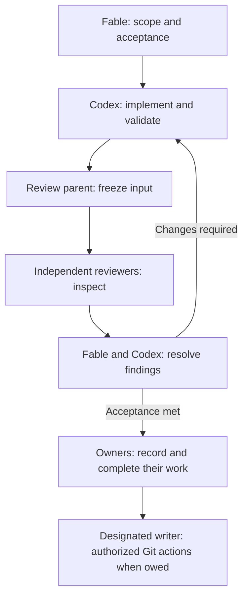

# Proposal: Fable and Codex working as a pair

Status: proposal for discussion and a pilot on an existing project. This document
does not change standing instructions, grant Git or publication authority, or
claim that the proposed Engram improvements are shipped.

The proposed default is a persistent pair: Fable coordinates the work and
evaluates its acceptance; Codex implements and validates it. Either can request
independent inspection. One named parent owns each formal review round, so the
pair does not accidentally commission duplicate reviews or competing gate runs.

This builds on the [development workflow](development.md) and the
[local work system](features/local-work-system.md). Repository instructions and
the user's existing authorization govern execution. The role names describe
responsibilities; they do not authenticate an actor or confer extra authority.

## What the pair should achieve

The user describes the outcome and makes decisions that require human judgment.
The pair carries authorized work through implementation, verification, review,
and recorded completion. Routine implementation decisions stay with the pair.
A new session can recover what is owed, by whom, and against which source state.

The pilot feedback already reports two useful outcomes: recorded decisions
prevented repeated investigation, and inexpensive finding capture preserved
follow-ups. Preserve that low cost. Add records at meaningful changes in work,
ownership, evidence, or decisions; avoid logging every exchange.

## Responsibilities

| Participant | Owns | Delivers |
| --- | --- | --- |
| User | Desired outcome, material scope choices, and explicit authority for Git or external actions | Decisions the pair cannot make within the existing authorization |
| Fable, coordinator | Scope, meaningful acceptance, decomposition, dependencies, resolution of review disagreements, and pending coordination actions | A bounded implementation brief and an attributed acceptance decision |
| Codex, implementer | The implementation claim, source changes, necessary tests, gate execution, and fixes | The changed files, validation evidence, and a precise review packet |
| Independent reviewers | Inspection of a fixed packet against acceptance and repository contracts | Findings with location, consequence, severity, and supporting reasoning |
| Named review parent | Gate evidence, freeze verification, child lifecycle, result collection, and recording consolidated findings | One accountable review round with explicit reviewer availability |
| TermAl host | Sessions, mailbox delivery, reviewer processes, and whatever execution mediation it actually provides | Durable communication and host-generated execution evidence |
| Engram | Durable work, dependencies, claims, findings, evidence, memory, and completion records | The shared work state available to the next participant or session |

Codex is normally the writable review parent because Codex owns the changes and
build artifacts. Fable reads the consolidated output and rules on acceptance
within the agreed scope. Fable may instead own a review round when that transfer
is explicit and the relevant project permits it; the gate and freeze owner must
remain unambiguous.

Fable can own coordination work without claiming Codex's implementation item.
An independent review child remains a read-only leaf. It does not become the
coordinator or acquire execution ownership by reporting a finding.

The cycle below describes responsibilities; its labels are not new Engram states.

The ordering of completion and Git follows the item's acceptance, as described
below; the diagram does not grant Git authority.

## The normal work cycle

### 1. Orient and agree on the next bounded outcome

At session start and after compaction, each persistent participant reads the
current Engram view, relevant item detail and project observations, and unread
TermAl mail. A selected focus item identifies context; the holder identifies
execution responsibility.

Fable turns the user's request into a short brief containing the outcome,
important exclusions, acceptance criteria, and any actual prerequisite order.
Codex checks that the brief contains enough information to implement it.
Resolve uncertainty that changes acceptance before coding; Codex handles ordinary
local design choices within that scope.

Capture small findings cheaply with a short title. Before executing substantial
work, add enough outcome and acceptance detail that a fresh implementer can
understand it. A title-derived default acceptance sentence is not evidence that
this has happened.

Use the existing prerequisite relation when one child really must finish before
another starts. Equal priority is not an execution sequence. A preferred order
that permits parallel work should not become a false dependency.

### 2. Record responsibility without competing claims

Codex claims the implementation item before changing it and completes that item
with the ordinary words. Parallel implementers receive distinct bounded items,
claims, and an agreed file/worktree division.

For a substantial episode with outstanding coordination actions, Fable uses a
separate coordination item under the same root. It records the next decision,
what it is waiting for, and what follows that decision. Fable claims and completes
only its own coordination work. One such item can cover the episode; a separate
item for every message would add unnecessary bookkeeping.

Arrange the graph so these obligations do not create a cycle: implementation
does not depend on completion of its own ancestor, and coordination can consume
review evidence before the implementation item is terminal. A required
coordination child should gate the root only when its outcome is actually
required.

A claim tracks execution ownership. Permission to mutate files still comes from
the user, repository rules, and any host-enforced resource leases. In an advisory
deployment, file ownership agreements are coordination conventions.

### 3. Implement and communicate meaningful changes

Codex implements the agreed slice, runs focused verification while iterating,
and records significant decisions, evidence, and newly discovered work in Engram.
Fable resolves scope questions and dependencies, and prepares the next useful
slice without changing the active implementation's acceptance unilaterally.

Messages should identify the work concerned, the new fact or decision, any action
required from the recipient, and the durable evidence location. Send when the
recipient needs to act or change course. A result already available in Engram
usually needs a pointer and a short explanation.

When another session holds an item, distinguish a new finding from a requested
change to its completion conditions. The holder can incorporate an agreed scope
change under its own authority. A discovered nonblocking follow-up should remain
recordable even when that scope change is inappropriate.

### 4. Validate and freeze one review packet

The writable review parent runs the required project gates and records each
executed result once. Every failure receives a cause and an action under the
project's gate policy. A rerun follows an identified fix or changed condition.

The parent then freezes the review input using the project's existing tooling.
The packet identifies:

- The intended behavior and acceptance criteria.
- The exact source basis and included change set, including relevant staged,
  unstaged, untracked, and deleted content.
- Gate commands, results, evidence locations, and the source state they tested.
- Known limitations and the questions requiring reviewer attention.

Fingerprints are computed from the actual input by tooling. Agents refer to the
artifact or receipt instead of inventing or manually maintaining digest values.

For this repository, the existing freeze covers the whole worktree and index.
A whole-worktree change invalidates that freeze even if the changed file belongs
to someone else. A narrower packet is usable only where the project's tooling
actually defines and verifies that boundary.

### 5. Obtain independent review

For Engram, the parent follows the existing `/review-changes` contract: gates,
freeze, exactly one Codex and one Claude `/review-code` child through TermAl with
`writePolicy: readOnly`, then freeze verification and consolidated results.
Only `/review-code` is delegated. The parent owns `/review-changes`.

Both children receive the same packet and acceptance. They inspect independently
before seeing each other's conclusions. Their job is to test the change against
the contract; a preferred verdict is not part of the prompt.

Review children do not edit files, run build/test/lint gates, mutate Engram, or
spawn more reviewers. Either persistent partner may request additional bounded
investigation when needed, but the named parent coordinates the formal round.

The parent retrieves the authoritative results and verifies the freeze before
using them. A missing or failed reviewer is reported as unavailable. A changed
packet requires renewed validation and review under the repository's policy;
previous approval applies only to the reviewed input.

### 6. Resolve findings and record acceptance

The parent consolidates duplicate findings. Codex explains implementation facts
and fixes accepted defects. Fable determines whether the resulting behavior meets
the agreed outcome and records the reasoning for any disagreement or deferral.
Independent findings are evidence; responsibility for the disposition remains
visible.

Project policy determines what blocks completion or check-in. Where the user
has already authorized deferring eligible Medium/Low findings, record each
follow-up durably and cite its disposition. Severity alone does not waive a
failed required gate or an unmet acceptance criterion. Ask the user only when a
decision exceeds the pair's existing authority.

An acceptance record identifies the packet or source state, the criteria
evaluated, the review outcome, and any accepted limitations. Distinguish the
coordinator's judgment from an observed test result and from the implementer's
assertions.

When a fix changes review input, Codex runs the applicable validation and the
parent starts the required new review round. Fable does not turn evidence for an
earlier source state into approval of the new state.

### 7. Complete and perform authorized Git actions

Codex records the implementation outcome and completes the implementation item
when its acceptance and Engram obligations are satisfied. Fable completes its
coordination work after recording the acceptance decision and discharging its own
remaining actions. The root closes only when required children, evidence, and
completion conditions are accounted for.

Completion, review acceptance, commit, push, and external publication are
separate facts. Follow each item's actual acceptance when deciding whether a Git
action must precede completion. A local completion receipt does not authorize a
commit or prove that one occurred.

The designated writer performs Git actions only under explicit user authority
already present in the session. In a shared worktree, inspect the index and exact
intended file set before committing. Preserve another session's staged content
and follow the project's supported path-scoped or isolated-worktree procedure.
If the recorded acceptance includes an authorized Git action, retain that
obligation until it is actually done.

## Communication and recovery

### Durable messages and durable work

Engram stores the work's durable meaning: outcome, responsibility, dependencies,
findings, evidence, and decisions. TermAl mailboxes deliver requests and changes
that another session needs to process. Review artifacts retain detailed packet
and reviewer output. Source-controlled instructions retain standing project
rules.

Use the durable mailbox protocol: list to obtain this participant's processed
cursor, read subsequent bodies, process them, and acknowledge through the last
processed sequence with compare-and-swap. Reply only when another action or
answer is needed. Retry an uncertain send with the same intent and idempotency
key. Acknowledgment records processing of a message; any resulting unfinished
work must have its own durable obligation.

Project `remember` entries can preserve attributed observations and references
to decisions. They do not create new binding rules or replace the instruction
files. Agent-private scratch is unsuitable for information another participant
will need to finish shared work.

### Resuming either partner

Before an expected interruption, update the relevant work record with the next
action, responsible participant, blocking condition, and evidence pointers.
After an unexpected interruption, recover from existing durable records and
verify any uncertain execution outcome.

A successful resume lets either partner answer:

- What do I owe, including reviews and coordination?
- What am I waiting for, and who owns it?
- Which source state or review packet does the current decision concern?
- What invalidates that decision, and what must happen next?

Use the current claim and delegation state. Never infer live ownership from an
old display or transfer another session's identity. The current holder can
explicitly renew a live claim with `claim REF --ttl SECONDS`, preserving its
identity and fence and never shortening its expiry. Renewal is refused while a
live handoff offer is pending. An expired claim follows the explicit recovery
path; a saved summary cannot renew it. During an interrupted
review, the parent recovers existing delegation results and checks the freeze
before commissioning another round.

Engram now lets any project-bound session append an attributed `note` to open
work without holding its claim, including blocked work and a child of a completed
parent. Fable can record a ruling directly on Codex's item. This observation
enters the project and root feeds; it does not renew a claim, create an execution
checkpoint or contribution, or earn completion-seal credit. When a ruling must
support completion, Codex explicitly cites it in holder-owned execution evidence
and the final checkpoint, preserving the original author's attribution.

The remaining resume limitation is that `next` does not expose a general
review-participation relation. Fable's own coordination item can retain its
outstanding actions while the decision itself stays on the work it concerns.

A compaction summary is a navigation aid to these records. Review acceptance,
packet identity, and child dependencies should not exist solely in that summary.

## Engram improvements exposed by the workflow

These findings are grounded in the supplied pilot report and inspection of the
current interfaces. The first row records a shipped response since that report;
the other rows propose further improvements. This document implements none of
the product changes. Track
implementation and deduplicate existing findings in Engram; this table is design
rationale, not a parallel backlog.

| Observed friction | Proposed improvement | Observable acceptance |
| --- | --- | --- |
| A reviewer could not attach a ruling to an active item held by its implementer | Shipped since the report: project-bound non-holders can append attributed observations on open work; scope changes and completion retain separate authority | The ruling is visible on the item and project/root feeds with its actual author, while the claim and acceptance stay unchanged; the observation has no checkpoint or completion-seal credit |
| Filing beneath a claimed item was refused, so the finding went elsewhere and needed a correction message | Make a nonblocking follow-up relationship usable for active claimed work; evaluate the existing optional-child representation, which already adds no completion requirement | A participant records the finding and its subject without a claim transfer or a new completion barrier |
| After compaction, a reviewer had no held implementation items and could not see what it owed | Make durable coordination/review responsibilities discoverable through the normal resume view; evaluate the coordination-item approach before adding a new role system | With no implementation claim, the participant can recover its recorded pending decision, packet reference, waiting condition, and next action |
| Text `show` exposed only a shortened latest note; JSON was discovered through trial and error | Provide an obvious bounded history/full-detail path in the normal receipt | An agent follows the receipt to the needed note without guessing commands; any remaining omissions are explicit |
| A bounded list produced an incorrect bug total | Distinguish displayed rows, matching totals when available, and unknown remainder; provide usable continuation or filtering | A partial page cannot reasonably be read as a complete count; exact counting has an explicit path |
| Viewing an item made it appear as the session's focus and was interpreted as ownership | Label selected context and execution ownership separately | After inspecting another participant's item, the next view clearly shows that participant as holder and this session's own obligations separately |
| A title-only item had tautological acceptance; long titles became a finding-body workaround | Preserve inexpensive creation while supporting a concise description or initial note and representing unspecified acceptance honestly | A short title can retain the finding's detail; an unspecified criterion remains visibly unspecified |
| Different running builds caused a reported diagnostic exchange and an unnecessary lifecycle workaround | Expose the running process's build identity through MCP and CLI diagnostics, with actionable mismatch information | Participants can identify the actual running builds without changing work lifecycle or inspecting private process state |

Three reports warrant verification before proposing additional machinery.
Mandatory child sequencing already has prerequisite support; inspect whether the
edges were recorded. The observed completion time after a displayed claim expiry
does not establish a fencing defect, because holder activity can extend expiry.
Projection failures need their exact cause classified as missing rebuildable
state, durable corruption, or an incompatible build; `doctor` success alone
does not establish the cause.

## Pilot and decision criteria

Use the existing migrated project and a bounded real change. Exercise the pair
through implementation, independent review, a finding, and a resume by each
partner. Keep any deliberate interruption clear of an in-progress material
action. Record concrete incidents on the relevant Engram work, with a small
aggregate observation at the end of the episode.

Measure repeated investigation, missed decisions, stale verification caught or
missed, commands needed to preserve a finding, recovery effort, and user
instructions needed after resuming. Count required copies or corrections between
mailbox and work records as friction.

Success means both participants resume with the right responsibilities and
evidence, findings stay attached to their subject, and the added bookkeeping costs
less than the investigation and coordination it removes. Compare with Beads only
where there is direct retained experience or evidence; this proposal makes no
comparative performance claim.
