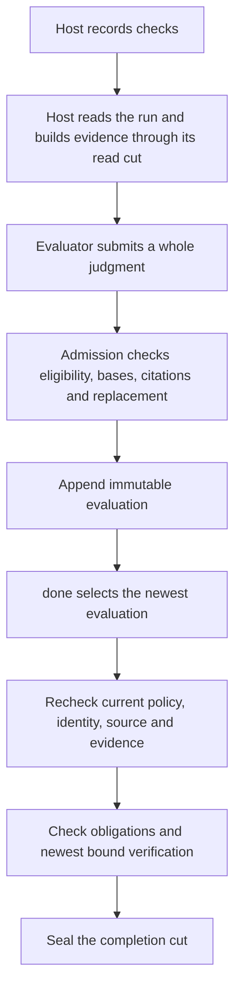

# Acceptance-evaluation lifecycle ownership

> Normative reference: [spec §2.6](../spec.md#26-local-work-graph--execution).
> Related contracts: [Acceptance evaluation](acceptance-evaluation.md),
> [Local work](local-work-system.md), and the shared
> [host integration contract](behavioral-control-plane.md#host-integration-contract).

This design review describes the implementation inspected on 2026-09-30,
after independent evaluation became the default and the declared-source
exemption landed. It proposes consolidation, without changing behavior.
The wrong-revision passing-check regression and clarified timing guidance
are present in this tree; that follow-up added no new owner or serialized cause.
Historical review evidence and follow-up references live in Engram.

## Decision flow

One immutable record judges the whole acceptance list. Recording decides
whether that judgment may enter the run; completion consumes the newest
record under current requirements. A previously admitted record is not a
permanent authorization to complete.

The implementation entry points are `record_acceptance_evaluation` and
`assess_on` in [evaluation storage](../../src/storage/work/acceptance_evaluation.rs).
`assess_on` selects through `latest_on`, calls `staleness`, and returns
absent, stale or fresh. The completion path and the evaluation-readiness
read in evaluation storage call `blocking_cause` on a fresh record.
[Completion](../../src/storage/work/completion.rs) derives the sealed verdict
results through `derive_acceptance_results`; it also enforces obligations
and binds their evidence at its own cut.

## Owners and decisions

Here, **evaluated cut** means the submitted run-feed position; **head** means
the run state read by the current operation. Current policy, task pin and
holder history are read again at consumption. The proposed shared owner
must retain each phase's inputs and reason for refusing.

| Rule | Recording owner | Completion owner | Decision |
| --- | --- | --- | --- |
| Project enables evaluation, admits the mode, and task pin agrees | `admit_mode` → `assess_mode_policy`; `admit_pass_citation` checks mechanical basis | `staleness` → `assess_mode_policy`, with explicit mechanical-basis retirement | **Mode and pin assessment is shared.** Admission alone refuses a self-asserted project before assessing the mode. Freshness re-reads the current policy and retires an asserted pass under a strengthened observed-basis policy; those phase-specific checks remain explicit. |
| Same-session mark author and sub-agent evaluator affiliation | `same_session_ineligibility` using `same_session_mark_author` → pure `mark_author` | The same `same_session_ineligibility` with current standing | **Shared and sound within asserted identity.** A mark author or child evaluator that later takes this run makes the earlier record ineligible. Imported history and a copied detach mark cannot invent an author. Session ids remain asserted; this does not authenticate a session against deliberate forgery. |
| Evaluator identity and sub-agent parent | `admit_identity` calls `SessionStanding::evaluator_is_independent` for independent affiliation | `staleness` calls the same predicate; child affiliation uses the shared helper above | **Shared and sound:** the independent predicate requires a known evaluator that neither holds nor held the run. **Justified difference:** admission requires the parent to hold/execute when the child submits; completion must not demand that original parent still hold the run after a legitimate handoff. Nor does it require a same-session evaluator to remain the current holder. |
| Named-root binding and judged source | `assess_named_root_binding` and `assess_named_root_source` in the admission phase, with `judged_source` and `declared_not_contradicted` | The same two owners in the consumption phase, from `staleness` | **Shared:** one binding decision and one source assessment, each with an explicit `RootPhase`; admission and consumption keep their own refusal and stale-cause wording. Admission rejects a declared workspace different from the named root and a changed root event between cut and head (`SourceChanged`); consumption rejects a changed stored binding as stale `mutation`. **Justified horizons:** admission requires an initial sighting through the evaluated cut but may accept a declaration awaiting the report. Consumption confirms a declared revision through head; an undeclared judgment uses the sighting through its evaluated cut. Declare a new revision, then let the host report it, is the concrete case. |
| Movement after the evaluated cut | `basis_moved_after` | The same `basis_moved_after` | **Shared and sound.** Both inspect later records; admission returns `SourceChanged`/`CheckRecorded`, while consumption maps movement to stale `mutation`. The different outward causes describe refusal versus invalidation. The same walk also returns the source observation that decided a source move, which the refusal and `show` name beside the cause; that is a diagnostic, not a cause, and the typed-cause corrections leave it as it is. |
| Passed-check, linked-environment and satisfied-resolution exemption | `same_turn::ExemptChecks::after` / `covers`, called by movement | The same helpers | **Shared and sound.** The declared revision and newest sighting must agree; a failed, indeterminate, wrong-revision or wrong-root check remains non-exempt. This compares sources, not grant identity. |
| Replacing a blocking evaluation | `reroll::reroll_assessment` → `contract_changed`, `new_evidence_between` | No replacement test at `done`; `latest_on` selects the newest admitted record | **Justified: admission alone authorizes replacement.** Qualifying evidence must be after the blocking record's cut and at or before the submitted cut. Merely appending that failure, changing policy, or renewing a claim does not qualify. Criteria/binding changes defer to carried-failure rules. |
| Carried failure after an executor-affiliated criteria/binding revision | `carried_failure_on`, `carried_anchor`, `judged_bindings`; `admit_supersedes` | `staleness` validates the current revision and eligibility; `blocking_cause` consumes the admitted verdicts | **Justified: acknowledgment is an admission fact.** The executor cannot erase its failed contract by revision; the replacement must name the carried record and come from a session that never held the run when required. Consumption does not re-author acknowledgment against a different historical moment. Discovery for the host uses the same carried-failure derivation. |
| Bound pass cites a check of the judged source | `bind_verdicts`, `admit_pass_citation`, then `stale_bound_citation` / `moved_after_check` | The same `stale_bound_citation` at the evaluated cut | **Shared source check; justified citation-admission difference.** Admission checks verdict coverage, citation kind, run and position. Consumption retains those immutable citations and checks their source meaning. A later check cannot become a citation retroactively. |
| Check satisfies an obligation | `VerificationAtCut::load_on` / `assess_on` when verification is recorded; `control::assess_obligation_satisfaction` → `match_verification_evidence` | `bind_acceptance_to_obligations_on`, `newest_verification_of_kind_on`, `binding_freshness_mismatch` → the same matcher, except for the completion-only recording-order fallback below; open obligations checked separately | **Justified: different guarantees and cuts.** Satisfaction concerns the obligation at the check's cut. Completion also rejects a newer relevant failed check or one that does not verify the latest mutation. Citation validation alone permits equal content after a move/revert; obligation matching can still owe a check after that mutation. Retain the fallback and typed mismatch in the completion adapter. |
| Completion fingerprint | Optional declaration stored with the evaluation; admission does not enforce `require_source_freshness` | `staleness` with `SourceCheck::AtCompletion`; absence of a source basis is also stale on reads when that policy is enabled | **Justified: recording a judgment and certifying completion are separate decisions.** Only completion has its fresh measurement; `Unmeasured` cannot call a declared fingerprint mismatched. A record without a source basis can be admitted but can never satisfy a policy requiring one. Preserve this admission/consumption difference; adding admission-time readiness checks would change behavior. |
| A newer gate supersedes one cited by a pass | `admit_pass_citation` checks the cited gate's kind and result; `bind_verdicts` checks its position at or before the cut; the movement scan excludes gates | `gate_superseded_after` checks same-name records after that cut | **Justified: the judgment's cut and completion's head differ.** A newer gate outside the evaluated cut may already exist at submission, so admission can append an immediately stale record. A newer same-name gate inside the cut is left to the evaluator's judgment by both phases: neither enforces newest-name selection within that cut. Preserve this existing F6 boundary when consolidating. |

`binding_freshness_mismatch` has a narrower completion-only fallback: with
no named root, when the latest mutation lacks a source basis or observation
time, it requires the verification's run-feed position to be after the
mutation's position. The pure matcher instead returns `InvalidProducer`
for that incomplete mutation context, so obligation satisfaction does not
use the fallback. Completion cannot compare the checked revision or time
in this case; requiring the full match would refuse every verification.
The existing fallback checks ordering, without asserting source equality.
Its boundary is covered by
`a_source_change_recorded_without_a_revision_is_judged_by_recording_order`
in the [binding tests](../../src/storage/work/completion/tests/bindings.rs).
Preserve this distinction in any matcher extraction; a change to its
assurance belongs in separately reviewed implementation work.

Supporting owners are in [same-turn exemptions](../../src/storage/work/acceptance_evaluation/same_turn.rs),
[replacement admission](../../src/storage/work/acceptance_evaluation/reroll.rs),
[verification assessment](../../src/storage/work/completion/assessment.rs),
and the [pure verification matcher](../../src/control.rs).
`off_named_root` already shares known-foreign observation filtering between
movement and replacement. An unknown-root source change is not presumed
foreign. Root rebinding uses the phase-specific binding checks above;
displaced obligations have separate checks. Observation filtering waives neither.

Two neighboring invariants also have distinct horizons. The service's
run/revision preflight can reject a stale request before assembling its
receipt; `record_acceptance_evaluation` owns the authoritative check inside
the write transaction. Consumption's `staleness` compares the stored run,
revision, item fingerprint and criteria with current state, so a later
revision retires an admitted judgment. For selection, live completion uses
`latest_on`; sealed-binding validation uses `newest_evaluation_through` at
the immutable completion cut. That historical check must exclude evaluations
appended after the seal. These differences preserve transaction authority
and live-versus-sealed horizons; they are not additional consolidation
proposals.

Citation closure has one storage owner, `ensure_acceptance_citations_within`
in completion: every sealed verdict citation must belong to the completion
evidence set the final checkpoint acknowledged. It applies to evaluated and
self-asserted completion. The
[completion service](../../src/work_service/completion.rs) adds a ready
evaluation's citations to that evidence set before capture; it prepares the
set without replacing the storage check.

## Replay of the review failures

These are transitions found during the independent-default and same-turn
reviews, rather than newly discovered runtime failures. The listed fixes
are present in the inspected implementation.

| Review | Concrete transition that exposed the problem | Drifting rule and correction |
| --- | --- | --- |
| Independent default, round 1: policy-blind core remedy | `done` lacks an evaluation under a restricted policy → its recovery suggests a mode the word layer would not admit | Two remedy decisions. Service and words now call `work_service::missing_evaluation_remedy(mark, admitted)`. |
| Independent default, round 1: restored mark author | Restore an already marked item → first native revision preserves its mark → revising peer is credited as its author | Mark presence was mistaken for a native unmarked→marked transition. `mark_author` requires a native creation or an observed native transition; otherwise authorship is unknown. |
| Independent default, round 1: self-evaluation called sub-agent | Executor cannot evaluate as same-session → submits `sub_agent` from its own session with itself as parent | Parent relation did not establish a distinct child. Shared `same_session_ineligibility` rejects evaluator affiliation at recording and consumption. |
| Independent default, round 2: detach invents authorship | Executor self-marks child → parent ends → another peer detaches child → copied mark appears peer-authored | Creation had two meanings. `carried_over` recognizes `DETACH_PROVENANCE_SOURCE`; copied creation is `MarkTransition::Other`. |
| Independent default, round 3: stale-policy word remedy | Outside author sets same-session mark → author later holds run → `done` says independent evaluation → task pin refuses that mode | The shared helper existed, but the stale-policy refusal used to receive only the empty default context. `handlers` now supplies the real mark and admitted modes through `EvaluationRemedy` for both missing evaluation and stale policy. |
| Independent default, round 5: foreign change unlocks re-roll | Fail under root A → report changed foreign root B → replace failure on unchanged A | Replacement's scanner omitted movement's root filter and seeded from a sighting instead of the blocking judgment. It now shares `off_named_root` and seeds from `judged_source`. |
| Same-turn design exploration: declaration still refused | Root sighted at old revision → evaluator declares final revision before checkpoint → admission still demands the old sighting | Separate declaration checks retained the old horizon. Admission now permits an uncontradicted declaration; completion requires its later confirmation. |
| Same-turn round 1: guidance promises every turn | Check old revision → edit again → evaluate final revision → host reports both revisions; or report a failed/baseline check | Guidance exceeded the exemption's source/outcome conditions. It now promises the shape where every reported check ran on the final revision and passed. Broader host deferral remains separate work. |

### Same-turn boundaries to preserve

| Transition | Required result and owner |
| --- | --- |
| Declare final revision; later report its change, passing check, linked environment and satisfied resolution | Movement remains fresh through `basis_moved_after` and `ExemptChecks`. Submission before or after the report follows the same rule. |
| Include failed/indeterminate or wrong-revision passing check beside a matching passing check | The other check is not exempt; sharing an environment does not hide it. Movement still requests resubmission or voids for source movement. |
| No declaration, wrong declared workspace, or wrong named-root generation/state | No passed-check exemption. A foreign known source sighting is filtered under the named-root rule; foreign check evidence is not thereby exempt. |
| Named root sighted at old revision; declare new revision | Admission may record; `done` is stale `source` until a matching host sighting. A never-sighted declaration keeps completion blocked and hides an older pass. Absence alone cannot predict whether a future report will confirm it. |
| Flag a source change A → B → A after the evaluated cut | A flagged change to a revision the evaluation did not judge voids the record even after the revert. Quiet sightings alone use the newest sighting; a quiet return to judged A leaves the record fresh. |
| Flag a source change A → B → A before the evaluated cut | A citation of the check at A can stand and the evaluation can be fresh. Completion's bound-obligation rule can still require a check after the latest mutation; citation freshness does not satisfy that separate rule. |
| Bound criterion's only passing check arrives after evaluated cut | It cannot support that record's pass. Rebuild evidence at a cut including the check and judge again. |

The declaration and report boundaries are covered by the
[same-turn tests](../../src/storage/work/acceptance_evaluation/tests/same_turn.rs)
and [named-root tests](../../src/storage/work/acceptance_evaluation/tests/named_root.rs).
The [basis-movement tests](../../src/storage/work/acceptance_evaluation/tests/basis_moves.rs)
pin quiet sightings away and back after the cut; the
[citation-source tests](../../src/storage/work/acceptance_evaluation/tests/citation_sources.rs)
pin a flagged move/revert before the cut, where the citation stands but
completion still owes a later check. The basis-movement tests also pin a
flagged move to B and back to A after the cut, in one turn or two, declared
or not: the evaluation stays void and names the change to B as the
observation that decided it.
The [evaluation tests](../../src/storage/work/acceptance_evaluation/tests.rs)
pin the beyond-cut citation refusal with a late asserted gate on an unbound
criterion; the same-turn tests pin it for a bound criterion whose only
passed host check arrives after the cut on the declared revision, where the
exemption lets the movement scan pass and the citation is still refused.

## Engram's side of the host check-and-cut guarantee

The shared receipt-and-cut wording is recorded in the
[host integration contract](behavioral-control-plane.md#host-integration-contract).
This section names Engram's implementation owners and the guarantee's
horizons. Agreement does not establish host implementation delivery.
Engram's guarantee has two steps:

1. An admitted work-bound `turn_checkpoint` atomically stores its supplied
   evidence and closes the begun grant. Its receipt returns the actual
   observation, verification and environment record ids. Verification source,
   outcome, command fingerprint and time derive from the validated producer.
   Refusal stores none of that report. Exact replay recovers its result.
2. A fresh work read begun after the receipt supplies `evidence_basis`, the
   head of that same run's execution feed. Every evidence id returned by the
   committed work-bound checkpoint is at or before any such later head of
   the same feed in the continuing canonical store history. This also holds
   for a replayed receipt: its ids name the original commit. Concurrent
   successful writers advance that feed's head. It does not apply to an
   older read snapshot, a different run selected after reopening, or an
   older store restored in place of that history. Evaluation admission
   checks cited records against its submitted cut and run, and checks
   movement after the cut.

Owners: `checkpoint_control_turn_with_evidence` in
[control runtime](../../src/storage/control_runtime.rs),
`TurnCheckpointReceipt` in [control types](../../src/domain/control.rs), and
the `evidence_basis` projection in
[work service](../../src/work_service/service.rs).
The checkpoint's task-audit cursors are not evaluator evidence positions.
The receipt also carries no run id: the host takes the run from the begun
grant's work binding. A session holding several claims can have its turn
bound to another claim's run; that checkpoint does not establish inclusion
in the run the session subsequently chooses to evaluate.

The host compares returned ids with the checks it intended to report and
reads the same run's head only after that receipt. Inclusion follows from
that call order, not inspection of positions in the receipt: it contains
ids without positions, and the work view's evidence window is bounded. The host
resolves an uncertain checkpoint without abandoning its exact intent and
builds the evaluator's evidence through the later read's cut. A smaller
fallback report proves only its own records. Increasing the
submitted cut while retaining an older brief does not establish inclusion.
These are host duties; Engram cannot discover checks the host omitted or prove
that an evaluator read and understood its brief.

Receipt inclusion does not prove obligation satisfaction, evaluator relevance
judgment, or authenticated identity. A late passed-check exemption preserves
freshness without putting that check inside the older evaluated cut. A bound
pass still needs matching recorded evidence inside its cut. Agreement on this
boundary is recorded with the design review; host implementation delivery is
separate from agreement.

## Structured causes and remedy ownership

A refusal becomes a core cause where its deciding rule has the facts. The
service translates that cause; words format an action using its supplied
context. A word must not re-infer policy, identity or source state from prose.

| Current cause path | Decision |
| --- | --- |
| Movement → `EvaluationBasisMove`; carried failure → typed carried-failure refusal; freshness → `AcceptanceStaleReason` / completion recovery | Retain these typed paths. They already distinguish admission from consumption. |
| Eligibility, root admission and citation refusal → `AcceptanceEvaluationAdmissionRefused` carrying `AcceptanceEvaluationAdmissionCause` | **Implemented:** the deciding storage guard supplies an `eligibility`, `source_root` or `citation` cause and its remedy action. Service/words and CLI JSON/MCP retain the original reason, error code and failure status, adding context without parsing prose. Re-roll and remaining structural refusals retain their separate owners and generic refusal shape. |
| Bound completion → `WorkBoundVerificationRefused` carrying `WorkBoundVerificationCause` | **Implemented:** the existing matcher mismatch, or `result_not_passed` from the preceding contradiction check, reaches service/words and CLI JSON/MCP with criterion, requirement, check and producer ids, actual result and typed remedy. The existing message, error code and status remain unchanged. |
| Source freshness → sibling `AcceptanceSourceRecoveryCause` | **Implemented:** the deciding snapshot retains the existing stale `source` cause and supplies confirmation, measurement or new-evaluation context. One service formatter supplies core recovery, words and show; raw errors preserve their message and status. |

`AcceptanceStaleReason::Source` retains its shared label for root confirmation and
completion-fingerprint failure. Root not yet confirmed and a declaration
that will never be confirmed are indistinguishable until another observation
arrives. The sibling context reports **unconfirmed declaration**, without claiming
to know the future. A missing completion measurement can be retried with a
fresh host measurement; an actual source mismatch or missing evaluation
source basis needs a new judgment. The word cannot safely promise that copying
the evaluation's fingerprint will fix any source refusal.

The relevant adapters are [service recovery](../../src/work_service/mod.rs),
[word recovery](../../src/verbs/handlers/completion_remedy.rs), and
[generic word guidance](../../src/verbs/receipts.rs). The latter still uses
prose inference for generic completion evidence/checkpoint failures; that is
a separate existing surface, not an acceptance-evaluation parser.
Storage also spells mode-selection advice in `host_evaluation_words` for
admission refusals. That independent-then-sub-agent choice agrees today with
the service/word remedy helper. Typed admission causes in correction 5
now let service and word advice use the shared remedy selection. The original
reason text retains its storage spelling; no consumer parses it to decide
eligibility.

## Ranked corrections

These corrections were ranked as separate implementation proposals. Ranks 1
and 2 are implemented by the shared `assess_mode_policy` and
`SessionStanding::evaluator_is_independent` predicates, with mode/pin and
affiliation tables, policy-strengthening and handoff regressions. Rank 3 now carries source recovery context from the deciding snapshot through service, words and CLI/MCP, with declared-root confirmation and fingerprint regressions. Rank 4
preserves typed bound-check refusal context through the existing error path,
with storage rollback and word/MCP regressions. Rank 5 now exposes eligibility,
source-root and citation causes through the existing failure transport, with
real service, native CLI and MCP regressions; the re-roll cause now joins
them, and the evaluation status shows it through the active run's head from
the same assessment the record transaction repeats. Rank 6 now reads a named root through one binding decision
and one source assessment, each with an explicit admission or consumption
phase and horizon. A characterization table pins every declared, undeclared,
contradicted, reverted, foreign, unplaceable, unsighted, checked, rebound and
ended case, measured before the move and unchanged by it; the admission
phase keeps the open-declaration check, and the same table records that no
case refuses on it alone while the movement scan finds nothing. The
remaining proposals need their own implementation and review. Size describes code scope, not a time
estimate. Preserve serialized contracts or coordinate their change with the
host; no compatibility shim is proposed.

| Rank | Correction and proposed owner | Transition it prevents | Rough size |
| --- | --- | --- | --- |
| 1 | Share mode/pin eligibility in evaluation storage; keep mechanical-basis checking explicit | A policy change is admitted by one predicate but consumed by another, or recovery names a forbidden mode | Small helper and admission/freshness regressions |
| 2 | Share evaluator affiliation using `SessionStanding`; keep submission-time parent relation separate | A self-affiliated independent/child session slips through one phase, as the self-sub-agent Medium demonstrated | Small predicate extraction with handoff tests |
| 3 | Make core recovery own unconfirmed-root versus fingerprint causes, and let service/words format that recovery (implemented) | `done` asks for a new judgment while a turn-boundary sighting would suffice, or suggests a fingerprint where no source basis exists | Medium typed cause and host-contract change; cannot separate awaiting from never-reported absence |
| 4 | Preserve typed bound-verification mismatch at completion (implemented) | A holder loses the inline newer-check contradiction or matcher mismatch at the error adapter | Small transient cause and shared guidance change with rollback and word/MCP tests |
| 5 | Expose typed admission causes for eligibility and citation/root refusal (implemented); retain separately owned re-roll work | A caller must infer whether to change a mark, record new evidence, or refresh the cut from a sentence | Medium storage/service/CLI/MCP change; stage by cause family |
| 6 | Share named-root assessment, including workspace and rebinding comparisons, with an explicit admission/consumption phase and horizons (implemented) | The same declaration or root event is independently interpreted by admission and completion, recreating the design failure | Medium extraction with declared, undeclared, contradicted, rebound and never-sighted cases; remove redundant `declared_not_contradicted` logic only after proving movement covers it |

The existing shared movement/exemption and verification matcher need no
second implementation. The re-roll and carried-failure admission guards
should stay admission guards; their different horizons are necessary.
