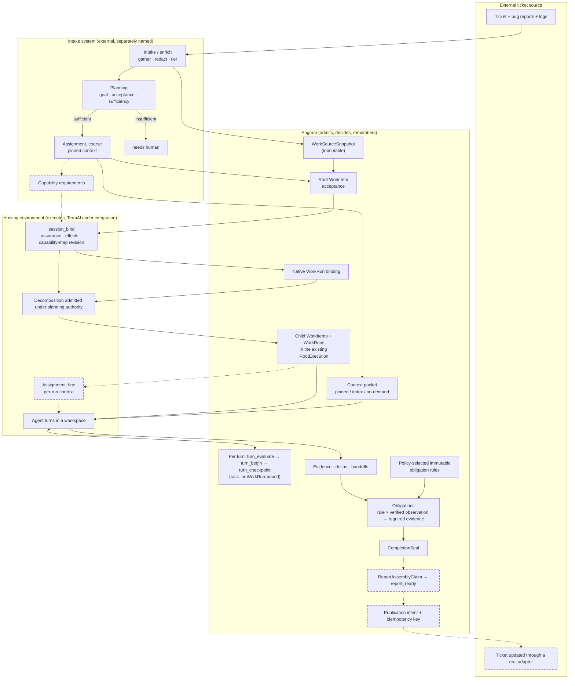

# Execution Pipeline

> Normative reference: [spec §9](../spec.md#9-local-work-reports--external-systems).
> Related briefs: [external adapters](tracker-adapter.md),
> [behavioral control plane](behavioral-control-plane.md),
> [local work system](local-work-system.md),
> [local tasks & reports](local-tasks-and-reports.md),
> [context packets](context-packets.md), and
> [security & trust](security-and-trust.md).

This brief is a map, not a new capability. It names the layers between an
external ticket and a published report, says which layer owns which decision,
and fixes where Engram's boundary sits in that chain. Everything Engram-side
here is either shipped or specified in the linked briefs, and the Status
section says which is which; the upstream layers are external, optional, and
separately owned.

## Status

Shipped in this repository today: the local work graph (`WorkItem`,
`RootExecution`, `WorkRun`, fenced claims, decomposition under planning
authority), the host-private turn channel (`session_bind` → `turn_evaluate`
→ `turn_begin` → `turn_checkpoint`) with exact live `WorkRun` binding, bounded
context delivery, host execution observations, typed verification/environment
evidence, immutable policy-selected obligation rule sets with the stock
source-change/test rule plus operator-selected exact check/environment pins,
obligation-gated `CompletionSeal`, the
`WorkSourceSnapshot` type and its admission path, and a
side-effect-free dummy publication adapter that proves the idempotency
contract.

Specified but not yet shipped: a `WorkSourceAdapter` intake port; fenced report
assembly (`ReportAssemblyClaim`, `report_ready`) and durable publication
intents; real external adapters; capability requirements on work; a general
obligation rule language; and project-wide environment requirements outside
the bounded typed obligation schema. Per-project required assurance is
selectable at bootstrap and through an
attributed, immutable policy update. Table rows and diagram nodes marked
**planned** are exactly the remaining items.

The shipped **obligation** substrate is deliberately small and typed. An
immutable policy version selects a canonical rule-set hash; the built-in set
implements `source_changed observation → test obligation → passed matching
verification | host-authorized waiver → CompletionSeal`. The observation and
definition freeze that selection, so activating another validated set affects
only future observations. Definitions and resolutions are immutable feed
objects. The seal records the exact definition/resolution pairs applicable at
its dense run-feed cut, and `work_complete` returns a bounded
`open_work_obligations` result until that set is terminal. A general rule
language remains planned.

The upstream layers — intake/enrichment, planning, capability and context
assignment — belong to an external, separately named intake system that is
not in this repository. TermAl is the first hosting environment under
integration through its host adapter; which hosting-environment adapter lands
first is a product decision, not a fact of this brief. Revisit triggers for
the deferred items are recorded in the [roadmap](../roadmap.md).

## One sentence

Engram **supports** execution: before each turn it evaluates whether and on
what basis an agent may act, and after each turn it records the host-supplied
checkpoint and explicitly captured evidence. It does not execute, and it does
not infer execution facts. The hosting environment executes; the intake
system proposes work inputs and supplies evidence snapshots; Engram admits
and owns local work; an explicitly authorized publication adapter reports a
frozen artifact back.

## The layers

| Layer | Owns | What lands in Engram | Mutable after landing? |
| --- | --- | --- | --- |
| **Intake / enrich** (external) | fetching the ticket; gathering evidence — bug reports, linked tickets, production logs; redaction; tiering into pinned / index / on-demand | an immutable `WorkSourceSnapshot` plus an evidence bundle | no — a refreshed ticket is a new snapshot and a visible delta |
| **Planning** (external) | goal, acceptance criteria, approach, sufficiency check (“can repro and acceptance be derived at all?”) | the root `WorkItem` with acceptance; the plan as a *proposal* | yes, under optimistic revision control and bounded planning authority; while a live claim exists, planning is claim-bound |
| **Capability & context assignment** (external, coarse pass) | which capabilities the whole item requires; which context tier is pinned | capability requirements on the item (**planned**); the context packet to deliver | yes |
| **Engram** | work graph, turn admission, exact bounded delivery, claims and leases, typed evidence, policy-selected typed obligations, obligation-gated seals, report freeze (**planned**) | — | — |
| **Hosting environment** (TermAl under integration) | agent runtime, workspace (worktree or sandbox), tools and skills, credentials, resource limits; enforcing Engram's decisions | `session_bind` with assurance, mediated effects, capability-map revision, and an exact live `WorkRun` binding; evidence from execution | — |
| **Decomposition** (admitted by Engram) | splitting the root once the code is visible, under the holder's claim-bound planning authority or a bounded planning delegation | child `WorkItem`s and their `WorkRun`s, registered in the existing `RootExecution`; each run is separately claimable, owns a dense run feed, and receives a seal on completion | under Engram admission |
| **Obligations** (Engram; typed canonical rule sets shipped) | selecting a bounded immutable rule set through project policy and turning matching host observations into concrete duties on their runs | a canonical `ObligationRuleSet` hash frozen into each observation and immutable `WorkObligation` definition (run, rule-set hash, rule version, triggering observation, required evidence kind), immutable resolution events (`satisfied` by matching verification evidence, `waived` by an attributed host-authorized decision), and exact definition/resolution bindings in `CompletionSeal`; a rebuildable projection holds current state | no — a policy successor affects only later observations and obligation state advances only by appending a resolution through an Engram transaction |
| **Capability & context assignment** (fine pass, under a claim; **planned**) | what each run needs delivered | per-run context packets (packets carry `work_id` and feed heads today, not `run_id`) | yes, per run |
| **Publication** (adapter) | returning the report to the ticket source | a frozen report, a publication intent with an idempotency key, a receipt (**planned** beyond the dummy contract) | no |

## The flow

Within Engram and the host-control path, dashed nodes are **planned** and
solid nodes ship today; solid nodes in the external layers describe upstream
responsibilities, not repository features.

The boundary between *before Engram* and *under Engram* runs between planning
and decomposition. Intake, planning, and the coarse assignment pass produce
immutable inputs and proposals, so they may run outside. Decomposition depends
on the code and is admitted by Engram under planning authority, so that every
child run is separately claimable, has its own dense feed, and is sealed on
completion — otherwise the upstream plan and the Engram work graph diverge as
soon as the agent starts.

## Rules that keep the layers honest

1. **Engram supports execution; it never executes.** Execution occurs in the
   hosting environment, while canonical claims, leases, grants, and every
   other form of live execution authority remain in Engram's SQLite store on
   the active host; the host enforces those decisions. The intake system
   hands Engram work inputs and evidence, not commands.
2. **Decomposition is admitted by Engram.** An upstream planner may propose a
   split or a revision; it remains a proposal until Engram admits it under
   the holder's claim-bound planning authority or a bounded planning
   delegation, creating child `WorkItem`s and `WorkRun`s that are separately
   claimable and sealed only on completion. "Mutable after landing" in the
   table means mutable **through an Engram transaction**; the upstream system
   never mutates canonical work directly. A dry split done without seeing the
   code is rewritten by the executing agent, and then two task lists exist.
3. **The evidence bundle is tiered, never dumped.** Delivery is exact and
   bounded ([context packets](context-packets.md)), so intake must decide what
   is pinned (acceptance, repro, the decisive stack trace), what is indexed
   (the list of available evidence), and what is on demand (full logs).
4. **Redaction must happen at intake.** The canonical store is immutable and
   content-addressed; what enters it cannot be unwritten. Production logs
   must be redacted before they become a snapshot, not after. Until a real
   redactor is installed, V1's visibly labeled no-op
   ([security & trust](security-and-trust.md)) must not be treated as
   protection or compliance assurance.
5. **Skills are host capabilities, not Engram objects.** Planned work records
   will carry capability requirements; today `session_bind` records only a
   `capability_map_revision`, not a capability map, and Engram does not
   enforce requirement matching. When matching ships, Engram makes the
   admission decision and the host selects the concrete skill when it creates
   the session.
6. **Intake is not an orchestrator.** A changed ticket is a new snapshot and a
   visible delta that the agent or a human decides to rebase onto; never a
   polling mirror or a last-writer-wins update of local work state.
7. **Insufficiency means a human, not an execution.** If repro steps and
   acceptance cannot be derived from the ticket and its evidence, the root
   item is created blocked for a human decision rather than dispatched. The
   largest risk in this pipeline is not missing automation; it is thin
   context turned into a confident wrong fix.
8. **The hosting environment is evidence, not just an executor.** Executions
   of the same work may differ because of environment and exact source state.
   The seal should eventually cite an environment fingerprint — image or
   toolchain, workspace base revision, the capability map declared at bind —
   so a report says not only what was done but in what. At minimum, an
   execution observation or verification record must bind the `WorkRun`, the
   workspace identity (worktree or image), the post-mutation source revision
   or fingerprint, the command or check fingerprint, its result, the host
   session, and timestamps. The shipped matcher enforces that binding and the
   latest source basis at the evaluated cut, so a test before the final
   mutation cannot discharge the obligation.
9. **Evidence is typed, not a bag.** A generic evidence collection makes
   completion rules ambiguous. Each kind has its own producer and binding:
   the `WorkSourceSnapshot` (intake: ticket, logs, bug reports — cited, never
   copied); `ExecutionObservation` (host-captured during turns: session, grant
   or action fingerprint, effect and outcome, observed state change, source
   and workspace basis); `VerificationEvidence` (tests, reviews, acceptance
   checks — the kind that discharges an obligation, bound to the obligation
   and to the source state actually verified, optionally linked to the exact
   environment object); `EnvironmentEvidence` (source revision and workspace
   identity plus a canonical toolchain, sandbox/image, workspace, and
   capability-map component identity). Component values are asserted host
   context, not attestation. An obligation names the kind that satisfies it;
   a seal over the
   wrong kind is not a seal, and today's generic `WorkEvidence` may remain
   narrative or acceptance support but never discharges a verification
   obligation.
10. **Intake proposes classification; Engram decides delivery.** The intake
    system may propose that a snapshot is pinned, indexed, or on demand, and
    may propose a context tier for the root; only Engram assigns the final
    kind, authority, and delivery, and only Engram can make something pinned
    behavioral policy. An external system never sets policy by labelling, and
    never creates or closes an obligation.
11. **Advisory is for integration; `turn_gated` is for acceptance.** The
    per-project required assurance exists so a host adapter can be integrated
    in shadow mode against a real store. It does not lower the default
    (`turn_gated`), and the behavioral acceptance test of this pipeline must
    run `turn_gated`: an `advisory` host is observed, not controlled, and a
    run under it proves integration, not enforcement.

## Two assignment passes

In the target pipeline, assignment is done twice, not once. The coarse pass happens before
decomposition, on the root: which capabilities the whole item requires and
which context is pinned. That is what decides which hosting environment may
take the item at all. The fine pass happens after decomposition, per run,
under the claim: what each child run needs delivered. Doing it once before
decomposition can only produce the coarse pass, because the runs do not exist
yet. Native run binding ships; the fine pass remains planned because per-run
capability requirements and packet assignment do not.

## Target acceptance sequence

1. One ticket source, one-way import: a `WorkSourceSnapshot` and a root
   `WorkItem` with acceptance and a tiered evidence packet, created by hand
   from a real ticket.
2. Execution through TermAl under the shipped control channel, with
   decomposition admitted under the agent's claim. Prerequisites for this
   step to be honest rather than shadowed: the host must be bound
   `turn_gated`. The project policy can already require
   `advisory` for a shadow host and later advance to `turn_gated` without
   rewriting prior policy history; an `advisory` run of the same sequence is
   the integration test, not the acceptance test.
3. Record a source mutation under the stock policy-selected rule set, observe
   `work_complete` refuse the open test obligation, record matching host
   verification linked to canonical
   environment evidence, checkpoint that typed evidence, and freeze the exact
   obligation and bounded environment basis in `CompletionSeal`. Then
   exercise the report path; until fenced report assembly and a real
   side-effecting adapter exist, the dummy receipt does not claim the ticket
   was updated.
4. Only after that loop has closed by hand several times: automated evidence
   gathering, then the sufficiency check, then capability matching.

## Not yet shipped

- **`WorkSourceAdapter` intake port.** The `WorkSourceSnapshot` type and its
  admission path exist; the port trait does not.
- **Fenced report assembly and durable publication intents**
  (`ReportAssemblyClaim`, `report_ready`). Only `CompletionSeal` and the
  dummy adapter's idempotency contract exist.
- **Capability requirements on work items** matched against the host's
  capability map at bind. Today `session_bind` carries only
  `capability_map_revision`; work items have no requirement field and no
  matcher exists.
- **Environment policy beyond exact typed pins.** Environment components,
  verification links, the seal's exact bounded environment-hash set, and an
  operator-selected V1 obligation requirement for one previously recorded
  environment hash ship. Conditions over component families, signed
  attestation, or project-wide environment predicates remain planned.
- **General obligation policies.** Canonical policy-selected rule sets, the
  stock source-change/test rule, immutable definitions and resolutions, host
  waiver, exact seal bindings, and named completion refusal ship. V1 accepts
  only its bounded typed trigger/requirement schema. Additional triggers,
  conditions, evidence kinds, blocking phases, waiver authorities, and a
  general rule language remain planned.
- **Automated evidence gathering and the sufficiency check** live in the
  external intake system, not in this repository.
- **A real publication adapter.** V1 proves the contract against the dummy.
