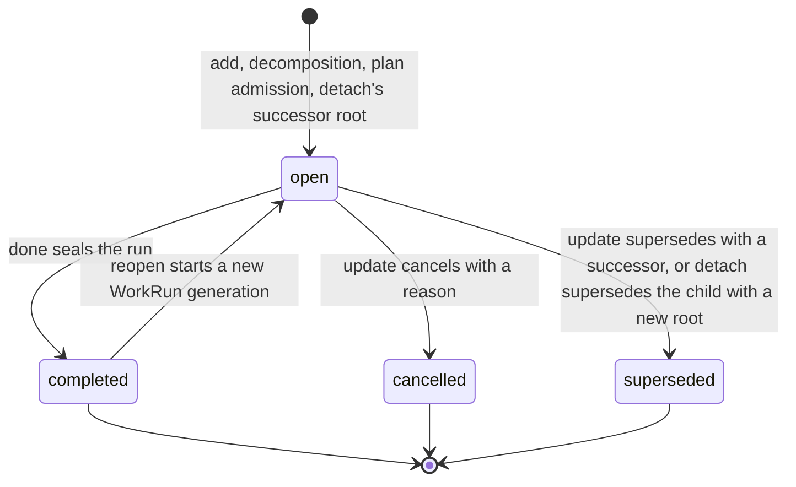
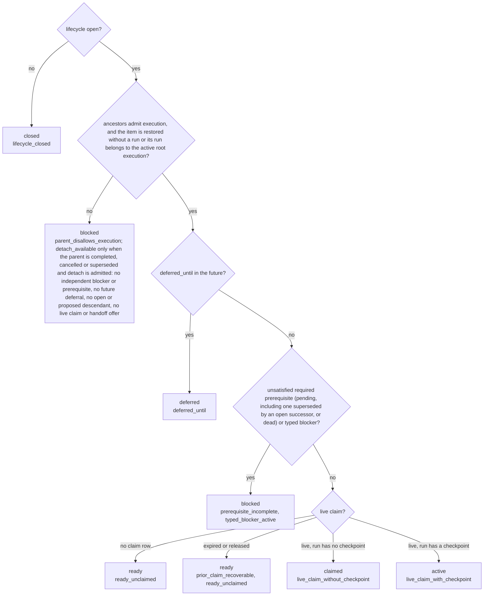
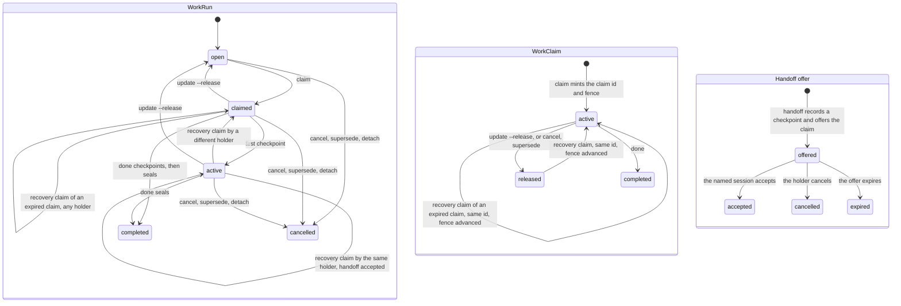
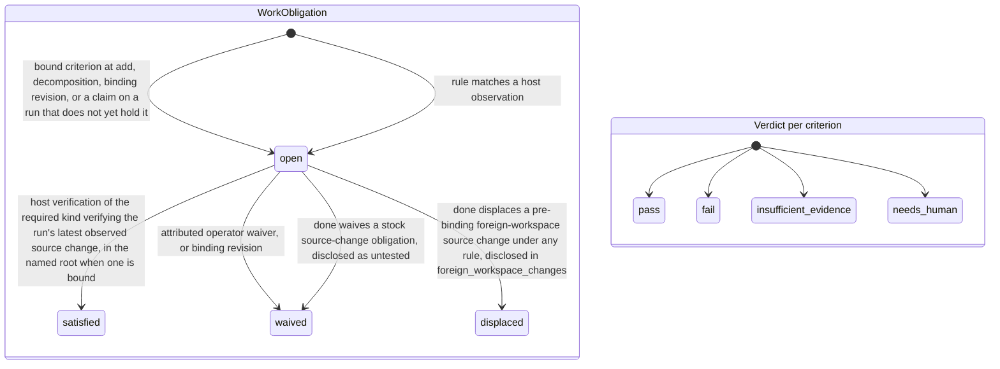
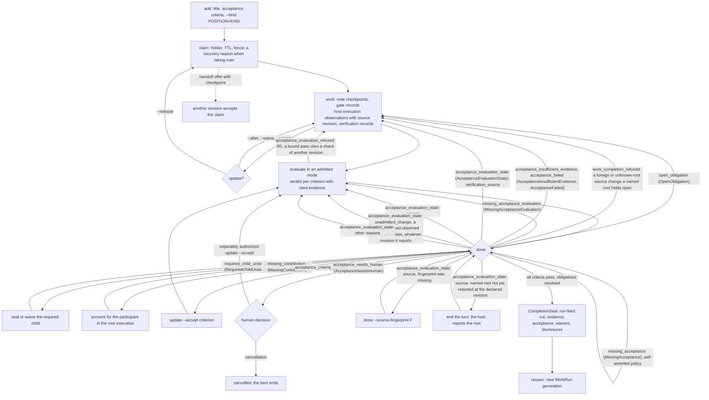

# Local Work System

> Normative references: [spec §2.6](../spec.md#26-local-work-graph--execution)
> and [spec §9](../spec.md#9-local-work-reports--external-systems).
> Related briefs: [behavioral control plane](behavioral-control-plane.md),
> [local tasks & reports](local-tasks-and-reports.md),
> [tracker adapter](tracker-adapter.md),
> [CLI & MCP](cli-and-mcp.md),
> [atomic work plans](atomic-work-plan.md),
> [write policy & review](write-policy-and-review.md),
> [acceptance-evaluation lifecycle](acceptance-evaluation-lifecycle.md),
> [security & trust](security-and-trust.md), and
> [execution pipeline](execution-pipeline.md).

Engram's target is a first-class, host-local graph of work. A user or model can open
work directly, split it into smaller units, express prerequisites, find ready
work, claim and hand off it, attach evidence, and complete it without any
external tracker. This is the local system of record for execution, not a
cache of Beads, GitHub, Jira, or another backlog.

See the [agent pair workflow proposal](../agent-pair-workflow.md) for a pilot of coordinator, implementer, and independent reviewer responsibilities.

External systems are optional at every boundary:

```text
                         optional immutable intake
 human / model prompt  ─────────────────────────────┐
 Beads / GitHub / Jira ─ snapshot + provenance ────┤
                                                    ▼
┌──────────────────────────────────────────────────────────────────┐
│ Engram core                                                      │── optional publication
│ local work graph · memory · coordination · behavioral control    │
│ evidence · report/finalization · canonical local store           │◄─► optional backup/portable/sync
└──────────────────────────────┬───────────────────────────────────┘
                               │ local control protocol
                               ▼
                     Host Enforcement SDK
                       ├── TermAl adapter
                       ├── generic CLI wrapper
                       ├── native runtime adapters
                       └── custom-agent library
```

An imported item becomes local work with an immutable source snapshot. A
later refresh is another explicit import event, never silent two-way
synchronization. A locally created item needs no external reference. A
completed item needs no publication target. SQLite is the canonical source of
truth in local-only mode. Optional backup, sequential portability, or later
concurrent synchronization increases durability/capability but never becomes
a precondition for valid local execution.

## Product boundary

| Component | Owns | Does not own |
| --- | --- | --- |
| Engram | Local work graph, readiness, dependencies, decomposition, claims, execution memory, evidence, completion, and publication intents | Starting/stopping model processes or silently changing external systems |
| Host runtime | Model/session lifecycle, prompt delivery, tool interception, user approvals, and enforcement of Engram grants | Reimplementing work readiness or granting authority independently |
| Agent or human | Goals, judgment, proposed plans, evidence, and choices allowed by current authority | Self-minting claims, grants, waivers, or publication permission |
| External adapter | Explicit source snapshot, optional backup/portable/sync, or separately authorized export/publication | Becoming an undeclared dependency or continuously mirroring tracker state |

The host may choose a model and start a process. Engram determines which local
work is ready and whether a selected session may act on it. Process scheduling
remains outside Engram; work scheduling belongs inside it.

## Durable concepts

### Work item

A `WorkItem` is a stable local planning identity. Its current view is derived
from immutable events and includes:

```text
WorkItem {
  work_id, short_ref, project_id, root_id, parent_id?
  title, outcome, acceptance[]
  kind, priority, labels[], assigned_to?, deferred_until?
  origin: local | imported
  source_snapshot_id?
  revision, created_by, created_at
}
```

`short_ref` is human- and model-friendly display syntax; `work_id` is the
stable collision-resistant identity. Titles, outcomes, priority, and
acceptance criteria change through attributed revision events rather than
in-place history loss. A corrupted or imported store that contains a short-ref
collision fails selection with a typed candidate list containing each full
work id, short ref, title, and lifecycle-backed `state`. CLI/MCP guidance names
up to eight ordered candidates, reports how many additional matches exist, and
requires the caller to retry with one full id; it never picks a candidate
implicitly.

`update --accept` replaces the whole acceptance list through the same revision
path, preserving omitted fields and refusing empty or blank criteria. Native
revision history derives changed planning field names uniformly from adjacent
canonical snapshots, without extra persisted revision metadata. A restored
item's first native revision compares against its immutable restore record.
Previous criteria remain in immutable events. Completed work cannot be revised.

`parent_id` expresses decomposition. A child is part of its parent's outcome;
it is not automatically a prerequisite of every sibling. Each child is
`required` or `optional` for parent completion. Parent and child remain
independently claimable work units.

Assignment is durable planning intent ("this actor should take this later").
It is neither a live work claim nor resource authority. Priority is an
explicit integer ordered by project policy and is user/policy-authorized by
default; models do not silently reprioritize the backlog. Work kind and labels
are typed/indexed fields, and children inherit configured labels.

An acceptance criterion may be **bound** to a typed verification requirement:
a `VerificationKind` (`test`, `build`, `lint`, `review`, `acceptance`) and,
optionally, one exact check, pinned by its command fingerprint — the
`check_fingerprint` the host records on verification evidence. The id of a
stored record is not one and is refused where the binding is authored.
Bindings are authored with the criteria
(`add`/`update --bind POSITION=KIND[:FINGERPRINT]`, a plan task's
`bindings`) and name criteria by one-based position: in the list as typed
when the list is authored in the same call, in the stored list `show`
numbers when bindings alone are revised. They are stored in the item beside
that list. A bound criterion is
enforced through the existing typed obligations: creating, claiming or
revising the item opens one `WorkObligation` per binding on the item's run,
triggered by that planning event; host-minted `VerificationEvidence` of the
bound kind (and pinned check) with a passed result satisfies it, with or
without a source mutation on the run. Host-minted means recorded through the
control turn checkpoint, the one path that records typed verification
evidence: enforcement needs no grant and no turn-gated hosting, but a host
that runs no control plane cannot mint that evidence and can only revise or
waive a bound requirement. `done` refuses while the obligation is open, and
refuses when the newest verification of that kind at the completion cut did
not pass, since a later failure outranks an earlier pass, or does not verify
the run's latest observed source change under the same rule that matches
verification evidence to a mutation (source revision, position and time, not
recording order alone), since it certifies code that has since moved; a change
the host recorded without a source revision offers only its recording order,
and that is what is compared. Both
checks belong to `done`; recording an evaluation does not apply them. When
the host binds a claim to a named source root, only a check captured in the
bound workspace and generation can satisfy a bound criterion. A foreign
workspace's pre-binding source change is disclosed as
`foreign_workspace_changes` in the seal with an audited `displaced`
resolution; it never becomes passing verification or an untested waiver.
A foreign change recorded under a bound name stays open until an explicit
human waiver. A change with no established workspace recorded while a root was
bound requires a fresh check in the claim's active named root or a waiver,
even after that root ended, was released or was renamed; one recorded while
no root was bound is waived as untested like any unbound change. A change in
the
root's own workspace from before the binding is satisfied by a later check of
the root's newest sighting. A later change in that root makes an older check
stale. The host records the binding and each sighting's capture-time root
generation, without deriving identity from path text; see
[the host binding](behavioral-control-plane.md#5a-bind-a-named-source-root).
Pre-binding means by generation: a foreign change is displaced only when its
sighting's generation is absent or below the binding's. Under a later name, a
sighting stated under an earlier, still-bound name is displaced only when it
was recorded in that earlier name's own root workspace; one already foreign to
that root keeps needing the human waiver across renames, even a rename to that
very workspace. Neither a later name nor a check made while the claim is
unbound, after that root ended or the claim was released, discharges it, and
`done` on an unbound claim refuses it too. A binding lasts as long as its
claim: renewal, recovery and an accepted handoff keep it, and an
`ended` event or the claim's release ends it. After an end or a release the
claim is unbound again, and a sighting recorded on the run feed after its
generation ended or was released is never displaced: a later matching check
satisfies its change, as without a root. Displacement depends only on where
and when a change was sighted, never on which rule opened its obligation: an
operator-selected rule, even one that pins its check, is displaced and
disclosed like the stock rule. A change with no source
basis is placed by its run-feed position and is never displaced. Under a named
root, the repeat rule compares a reported change within its own workspace.
The seal binds the obligation, and an asserted criterion cites the verification
that carried it when the completion cites it. Under an evaluated policy a
bound criterion passes only on an `observed` basis citing that evidence —
never judgment or an asserted gate — and seals with exactly the citations it
was judged on. Each of those checks must have run on the source the evaluation
judged (its declared source, or else the run's newest sighting at the
evaluated cut), and the source must not have moved away by that cut: the
newest sighting after the check shows its revision, and no change without a
revision was reported after it. `evaluate` refuses any other citation, and
`done` treats a record holding one as stale
(`verification_source`), whether the binding's obligation was satisfied or
waived ([acceptance evaluation](acceptance-evaluation.md#record-time-validation),
R5 and F8). A revision that drops a binding waives its obligation in the
revising actor's name. A binding the preceding revision did not carry
unchanged — a new one, one added back after being dropped, or one whose
sentence was rewritten — owes its verification from that revision, because
an earlier pass answered an earlier authoring; `--accept` without `--bind`
drops every binding, and the receipt says so.
Free-text criteria are judged as before.

### Root execution and work run

A `RootExecution` is the aggregate execution generation for one root work
item. It owns the expected contributor roster, membership of current child
runs, required child `CompletionSeal` ids, reason-attributed waivers for
cancelled or superseded required children, root-level decisions and other
waivers, and the root completion barrier. It does not own working memory.
Each capture retains its focused `WorkItem` as the provenance subject, while
shared applicability is keyed to that item's stable root. It therefore
survives reopen and replacement execution generations and is visible from
sibling or descendant focus in the same root.

A `WorkRun` is one execution generation for exactly one work item. In V1 it
has exactly one ordinary executor and at most one live `WorkClaim`. It owns
that executor's ordered execution feed, checkpoints, evidence, and completion state. Parallel sessions execute distinct child work
runs under the same `RootExecution`; they do not share mutation authority for
one run. Root members that do not claim the focused run may inspect permitted
root memory and communicate, but cannot receive an ordinary mutation or
completion grant for that run. V1 permits at most one active run per work
item. Reopening completed work creates a new run instead of reviving stale
grants, claims, or evidence from the previous generation. Every claimed
mutation also rechecks that all ancestors remain open and that the run still
belongs to the one active `RootExecution`; a completed root therefore fences
unfinished optional descendants even when their item lifecycle remains open.

This separates durable planning identity from live execution authority.
Protocol records bind both `work_id` and `run_id`.

Root state has one immutable empty origin per execution generation. Each
change adds an immutable `work_root_delta` object with a predecessor address,
consecutive root-state sequence, previous revision, fixed metadata, exact
member additions/removals, and a checksum of the complete resulting state.
The delta is the head object; its checksum is not an object address. Events
refer to this head instead of embedding all root collections. An unchanged
root reuses its head. Runs, child seals, child waivers, contributors,
contributions, and participant waivers all support both addition and removal.
The root's `updated_at` is a recorded caller-supplied timestamp, not a clock
for ordering or authority. It is bound by canonical equality and the checksum,
but need not increase. Predecessor addresses, root-state sequences, revisions,
and dense feed positions carry the relevant order; claim expiry is separate.

Current storage keeps a fixed header/head row and separate member rows.
Readers assemble these rows and check the complete state checksum, including
missing or extra members. Historical reads follow the addressed generation
back to its origin, check consecutive deltas and every intermediate result,
and never substitute the current head. Doctor replays each generation once,
as described below; it also checks historical event references in feed order
and rejects unbound delta objects. These checks do not authorize repair of
runtime state. See [SQLite storage](sqlite-store.md).

This bounds the bytes written for a fixed-size new root fact, not the CPU
cost of reading or hashing the aggregate. Current validation remains linear
in current membership. Evidence and checkpoint writers reuse the validated
member map and pass a transaction-bound head proof to event append. A stale
proof refuses; it never reloads a different state as a fallback.
Live completion now uses a narrower validation contract for required-child
waivers. It fully checks the current root state, then follows that head's
predecessors to the empty origin. Each cited waiver must be an exact addition
on this chain and must never have been removed after that addition. Removal
followed by an identical re-addition also refuses. The read reverses all exact
member changes; it does not assume that ordinary writers are the only possible
source of canonical history. Other parents' waivers do not require a separate
historical-state read for this completion.

This live proof does not check historical full-state checksums. A re-canonicalized
historical head with a false checksum can pass the fact proof if the required
facts, chain, and current full checksum are valid. This is an explicit
narrowing of live validation, not an unchanged integrity contract. Checksum
representation and meaning have not changed.

Doctor and graph export replay each generation once, from its empty origin to
its last head. The replay checks that every delta continues the one before it,
removes only members that are present, adds only members that are absent, and
never leaves two waivers for the same child or participant. It compares the
full-state checksum at the last head only, and compares that state with the
current rows. The work is linear in the generation's deltas and their members.
Required-child waiver events are checked against the membership the same
replay recorded for their heads. A delta that changes the final state is
therefore detected. Not detected: a stored checksum of an earlier head that
disagrees with its own state while the last head agrees, and a change to an
earlier delta that leaves the chain valid and the final state unchanged. When
the last head disagrees, a second replay compares every head and the report
names the first one whose checksum disagrees, as
`work_root_delta:HEAD:first_checksum_mismatch:SEQUENCE`. A read of the root
state frozen by one completion seal still compares every head up to it.

For a fresh completion, the remaining checks have a specific scope:

- Admission, reads, proof, seal, and event share one writer transaction.
  Refusal commits no partial completion.
- The current item, run, claim, fence, holder, expiry, and active generation
  must agree with their canonical bindings. A projection is not new authority.
- The current root's complete state and every member hash are checked.
  Each used waiver must match its direct child and canonical event exactly.
- The proof checks ancestry, exact additions and removals, revision continuity,
  and reversal of the complete chain to its empty origin. It does not merely
  test whether a cited object exists.
- Checkpoint, run evidence, feed cut, acceptance, required children,
  obligations, and completion drain retain their separate admission checks.

These checks do not authenticate actors or prove that the whole store has
never been rewritten. Acceptance and evidence relevance remain author
assertions. A successful completion is not a full-store health report.

The full audit is on demand, not periodic. An explicit `engram doctor` or
`engram graph save` runs the replay described above. Projection repair also
calls `verify_all` before commit, including that replay; backup and restore
verify their copies. An operator can include an audit in installation
procedures, but installing a binary alone does not schedule one. Ordinary open
and `done` do not schedule that audit, and fixture checks in CI do not audit
the active store. A last head whose checksum is false can therefore remain
undetected until an operator or host requests a full audit; Engram does not
guarantee a maximum detection delay. A false checksum on an earlier head is
not detected by the audit at all while the last head agrees. Only a read of
the root state frozen by a completion seal compares the heads up to that seal.

The fact proof loads each delta once and hashes the current state once. Its
member work depends on the current members, requested waivers, and actual
addition/removal payloads, with map lookup costs. There is no fixed waiver
count: terminal children can accumulate while the open-child count stays low.
Tests therefore vary waiver count as well as other history. The proof does not
multiply the current-state checksum bytes by the waiver count.
The chain length is the entire current generation, not just the distance to
the oldest cited waiver. Generations do not rotate automatically; only an
explicit root reopen starts a new native generation. A root kept open can
therefore accumulate an unbounded history. This proof removes repeated
full-state hashing, not dependence on history length.

Stopping at the oldest requested waiver was considered and rejected. It would
retain a proof of the suffix implied by the current state, but would no longer
check the prefix or empty origin during live completion. The chosen contract
keeps those checks. In the scale phase's history fixture at 1,000 checkpoints
(the gate now builds 500; `ENGRAM_ROOT_DELTA_SCALE=1000` builds 1,000 on
demand), the implemented proof reduced full-state checksum input for root
completion from 103,248,645 bytes to 613,338 bytes. The full audit of that fixture hashed 257,098,620 bytes
while it compared every head; comparing the last head only, it hashes 209,661.
These are checksum-input counts, not elapsed time or the cost of scanning the
suffix.
The additional loss of prefix validation was not accepted for an unmeasured
further saving. This is a rejected design option, not unfinished work. A future
measurement of traversal cost can justify reconsidering that trade-off.

A replay walks back from the addressed head to the origin, keeping each
decoded delta, then applies the deltas in forward order. Its memory is linear
in the generation's delta payloads. Doctor and export hash the full state once
per generation. The strict read of a sealed root state hashes every
intermediate state, which is quadratic when history and membership grow
together.
Each native completion seal names the exact pre-completion `RootExecutionRef`
instead of copying root contributors, contributions, and participant waivers.
The completion delta must directly extend that head. A different head in the
same generation is not a substitute. Per-item required-child seals, waivers,
and resolutions remain in the seal because they describe that item's barrier,
not the entire root's accounting. Historical accounting reads follow the sealed
address and verify the whole history, even after a later root reopen.

The current-fence checkpoint already commits its holder and contribution to
root accounting atomically. If either fact is missing at completion, `done`
refuses with `InvalidWorkProjection` and diagnostic guidance. It does not add
the missing facts silently. This is a stricter admission check, separate from
the narrower live historical-checksum contract above. `engram doctor` is the
diagnostic entry point; projection repair cannot invent missing canonical
accounting. Any restoration requires a verified source, not a repeated `done`.

Memory scope does not recursively walk arbitrary ancestors. A shared
`Scope::Work` records the focused work id for provenance and feed routing, but
its read applicability is the verified root id. Private `Scope::Agent { work
}` scratch remains exact-item and owner-only. This lets reopen preserve shared
decisions and constraints while resetting execution state, lets sibling work
consume common root guidance, and prevents private scratch from leaking
across sibling focus.

### Work source snapshot

A `WorkSourceSnapshot` records adapter kind, canonical external reference,
captured time, source revision/fingerprint, projected fields, and canonical
payload hash plus bounded extension data. [File intake](source-intake.md)
stores a typed snapshot as provenance under a minted id. First import requires
an authored local title and outcome; it does not map external fields into
local work. Refresh records an immutable source-change notice that applies
nothing. It never overwrites local state or implicitly reopens/completes work.

### Work claims

A **work claim** reserves responsibility for a work item or run. It prevents
duplicate execution and supports assignment, heartbeat, handoff, expiry,
and recovery. It does not authorize file or external mutation. The separate
resource-lease engine has been removed; hosts and users retain mutation authority.

A successful note, update, evidence, checkpoint, or handoff by the current
holder advances work-claim expiry to at least one hour after that mutation
without shortening a longer explicit TTL. Successful
completion instead terminalizes the claim at the completion timestamp.
Keyless `claim REF [--ttl SECONDS]` explicitly renews a current holder's live
claim to `max(existing expiry, now + TTL)`, with a one-hour default. Its claim
identity and fence stay fixed; an immutable `claim_renewed` event records the
renewal. An explicit core idempotency key replays its original result instead.
Renewal is refused while a live handoff offer is pending: cancel the offer,
or let it be accepted or expire before attempting another holder mutation.
A non-holder `note` on open work is a project/root observation only: it neither
renews a claim nor creates a checkpoint or run contribution. A
later `note` or `gate` is the narrow exception: any project-bound session may
append an attributed late finding to the completed run without a claim,
checkpoint, renewal, reopen, or reseal. Other holder words remain refused and
name `note` as that path rather than suggesting a reopen. A
holder mutation on a lapsed claim is refused with one recovery command:
`engram work claim <ref>`. When the work is ready, that ordinary claim command
retakes the same holder's claim under the stable project/session binding,
advances the fence, preserves an active run, and needs no recovery reason.
The session learns of the lapse before a write refuses: every agent read
(`next` and `next --peek`, `ls`, `search`, every `show` form and every
`memories` form) carries the reminder `your claim on REF lapsed; reads never
renew it; renew it with engram work claim REF` while open work's current
claim is still recorded as this session's and its expiry has passed. It names
at most one item, preferring the session's focus, then the latest expiry. It
is read in the same snapshot as the rest of the receipt (inside `next`'s
advisory cut; for the other words in the one read transaction their read-only
connection holds for the whole word), and changes nothing: no claim, fence,
expiry or focus moves, and only `claim` renews. A released, ended or
taken-over claim, terminal work, and other sessions' claims give no reminder.
The check is advisory: if it fails, the read still answers and says `could not
check whether your own claims lapsed`. Fitted reads reserve its bytes, so
their `byte_budget` is the ceiling their content was fitted to, and `next`
keeps it whole like the backup reminder. Every read with a lapsed claim
carries it. A new project-memory version is admitted with 160 bytes of room
for it in its full read, so that read fits within 12,288 bytes; versions
stored before the reserve keep the bound they were admitted under, so they
can still be revised and retried exactly. Such a stored version's `memories
KEY --full` read carries the reminder too and may then reach at most 12,448
bytes (12,288 plus the 160-byte reserve), in JSON and in text; the
worst-case history navigation its admission reserved usually absorbs it.
Every other fitted read stays within 12,288 with the reminder. The explicit
complete reads (`show --full`, full-note detail and `show --evaluation`)
remain unbounded, as before, and carry it as well.
`claim --under PARENT` (core update `claim_next_ready`) selects the parent's
next ready direct child by the same derived readiness and the `ls --ready`
order, then claims it inside that one write transaction under SQLite's single
writer, so concurrent callers are served distinct children; a child this
holder already holds under the parent is renewed instead, found from claim
metadata without reading any sibling (so a renewal's ready count is the
projection's and advisory, while a fresh selection's is verified), a ready child
lapsed under an unaccounted holder is passed over without a recovery reason,
and a call with nothing ready refuses and claims nothing.
Every handoff offer expires no later than its source claim. Expired offers are
swept inside the completing mutation transaction, so a refused completion rolls
the sweep back with the rest of that attempt. The immutable expiry event is
therefore appended at the clock of a later successful sweeping mutation; a run
with no later mutation has no expiry event even though readers already treat
the offer as expired. Taking over from a different, unaccounted holder still
requires attributed recovery.

A holder gives up its claim with `update REF --release [--reason "why"]` (MCP
`update` with `action: "release"`). A holder with neither a contribution (a
note, gate, or checkpoint made while holding a claim) nor a participant waiver
under the item's root execution must give a nonblank reason: the release
records it as the attributed participant waiver of that missing contribution,
and its receipt says so. The holder is then accounted, so the next holder
claims without `--recover`. A release without that reason is refused with
`work_release_waiver_required`, changes nothing, and names the `--release
--reason` command. An accounted holder, one that already contributed or was
waived by an earlier release, may omit the reason (the release then records
`released`), and no new waiver is written. Whether a release recorded the
waiver is stored with its result, so a replay or a receipt recovered after an
interruption reports the same decision. A waived session may claim again and
contribute; the waiver and the contribution are both kept. A claim that
expires without a contribution is not waived by its former holder afterwards:
its successor still takes over with `--recover`.

A work-bound execution turn must carry the live work claim. Shared analysis
may use an independent child claim; resource leases are not required. Root-level observation and
communication may instead use `RootExecution` membership; membership never
authorizes mutation or completion of another executor's run.

### Completion seal and report assembly claim

Every completed run produces an immutable `CompletionSeal`. Root completion
additionally binds every required child seal or an explicit
`CompletionWaiver`-authorized omission with the child's exact disposed
revision, plus the `RootExecution` roster, contributions, decisions, and
attributed waivers. Cancelling or superseding a required child never satisfies
the barrier by itself or through an unrelated replacement. The designed
[work-graph snapshot](work-graph-snapshot.md) adds the one completion proof
that is not a seal: a child loaded completed carries an inert
`RestoredRecord`, the parent seal lists it under `restored_child_completions`
beside its required seals and waivers, and report assembly refuses a root
whose completion transitively rests on one. Sealing terminalizes
the run's `WorkClaim`; completed execution authority is never kept alive for
report work. Resource leases have been removed.

A seal may also record a landing: where the completed work landed, as the
completing agent states it at `done`. It holds the commit (40 or 64 lowercase
hex), the remote and branch it was pushed to, the push time, and the build
fingerprint of the binary installed from it when one was installed. It is
asserted provenance only; the host-measured content fingerprint stays the
freshness identity. The full build value to give `done --installed-build` is
the `build_fingerprint` that the installed executable itself reports: run
`readiness --json` or `doctor --json` by the installed executable's path after
copying it, since a long-running MCP process still reports the build it
started with. `--version` shortens each token, and a shortened value is never
completed by hand. `show` prints the landing on a completed item, and the
completed item's JSON carries it as one `landing` field. The installed build is
shown in full beside "asserted, unchecked" (JSON `installed_build_assurance`),
or as "no installed build recorded" when the seal names none; the words are
derived when read, so old seals read the same way and no seal is rewritten.
Engram never compares it with any build. A seal without a landing reads "no
landing recorded", and a seal that could not be read, or a completion restored
from history, reads "unavailable" with the reason. Seals written before the
field existed carry none: they are read as stored, with no backfill, and their
landings stay in the prose landing notes (commit, gate run and freeze
fingerprint), a practice that remains valid beside the typed record. A landing
made after `done` is recorded the same prose way, because the seal is frozen:
`done` naming a landing its seal does not already record is refused as a late
finding. On request only, `engram doctor
--check-landings [--repo PATH]` asks a local repository whether each recorded
commit exists under exactly its recorded id and lies on the named remote
branch's remote-tracking ref. It never fetches, and names an absent commit, a
commit off the branch, or a remote-tracking ref not present locally; a git call
that fails, as in a damaged repository, leaves the landing unverifiable, as does
a commit not found on the branch of a shallow repository, whose cut history may
hold it. Apart from Git's answer, it prints each landing's installed build as
`show` does, in full beside "asserted, unchecked"; the build never enters the
verdict and is never compared with the executable running the check. When the
repository cannot be read, every landing is still listed with its installed
build, each marked as not checked, except one whose stored shape fails
validation, which reads malformed. An absent installed build has two JSON
shapes on purpose: the check's report gives every landing the same members
and writes `installed_build: null`, while `show` and the `done` receipt keep
the seal's own shape and omit the member. Both carry
`installed_build_assurance` "no installed build recorded".

Every new seal also declares completion-obligation schema V1 and records the
exact `(definition, terminal resolution)` pairs applicable at its pre-seal
dense run-feed cut. First, each still-open obligation of the stock
source-change rule is resolved as a waiver in the completing actor's name,
inside that cut, unless a named root, active now or bound when the change was
recorded, changes its disposition. A pre-binding foreign change receives an
audited `displaced` resolution under the stock rule and any operator-selected
one alike, and is disclosed separately, once. A foreign change
recorded under a bound name stays open for an explicit human waiver, even
after that root ended or the claim was released; an unknown-root change
recorded while a root was bound needs a fresh check in the claim's active
named root or that waiver, and with no root active `done` refuses it. In the
ordinary unbound case,
a source change with no matching passing test is recorded as untested instead
of refusing ([behavioral control
plane](behavioral-control-plane.md#5-checkpoint-the-turn)). Any other open
obligation refuses sealing before any terminal work mutation. A required child
seal is decoded and checked recursively, and every accepted seal carries the
current obligation-schema binding.

Post-completion `note` and `gate` evidence is appended after that immutable
cut. It reuses the sealed claim identity and fence only as historical binding,
while its `ActorContext` names the current project-bound session and carries a
`work_evidence:post_completion` / `post_completion` marker in the existing
provenance chain. The late evidence appears in `show` and project/run feeds,
but never enters the old seal, mutates root contributions, adds a completion
barrier, or makes completed work active again.

New seals also declare environment schema V1 and bind the exact sorted,
distinct set of environment-evidence ids visible at the same dense cut.
The set is capped at 64 and contains ids only: canonical toolchain,
sandbox/image, workspace, and capability-map components remain in their own
evidence objects. Every accepted seal carries the current environment-schema
binding. Environment identity is audit evidence: an environment record
belongs to one run and one source revision, so no requirement can name one.

Optional report assembly therefore uses a distinct post-completion authority:

```text
ReportAssembly {
  assembly_id, root_id, root_execution_id, completion_seal_hash
  generation, state, revision
}

ReportAssemblyClaim {
  claim_id, assembly_id, generation, holder
  expires_at, revision, fence
}
```

The planned assembly claim is not a work claim and does not permit
ordinary workspace mutation. Assembly binds the completion seal,
assembly generation and revision, and live assembly-claim fence; no finalizer
turn purpose or phase exists in the host protocol.
Handoff, expiry, and recovery advance that fence. Reaching `report_ready`
terminalizes the claim and freezes the report bytes.

## Lifecycle and derived readiness

Engram does not squeeze planning, availability, execution, and publication
into one status field.

The shipped alpha lifecycle is:

```text
open -> completed
  |\-> cancelled
  \--> superseded

completed --reopen--> open with a new WorkRun generation
```

`proposed` is a declared lifecycle word: ordinary creation, decomposition and
plan admission persist `open`, and executable operations refuse a proposed
item; a graph-snapshot restore may persist it and a planning revision admits
it, so it can exist without a shipped operation that admits it into `open`.

The target controlled-completion lifecycle inserts `completion_pending`
between `open` and `completed` only when Engram must drain mediated actions. That state is not emitted by the shipped zero-linked-
state completion path.

Availability is a derived projection over the open item:

- `ready`: admitted, not deferred, required prerequisites complete, required
  parent constraints satisfied, and no active claim.
- `claimed`: a live claim exists but no first execution checkpoint has landed.
- `active`: claimed and execution has checkpointed progress.
- `blocked`: at least one typed blocker remains. Blockers may be a prerequisite
  work item, a required human decision, missing external input, policy, or a
  manually recorded condition.
- `deferred`: a future wake time or explicit wake condition is active.
- `waiting`: a declared word for work that intentionally waits for a named
  event while retaining responsibility; unlike `blocked`, it would not be
  advertised for reassignment. No shipped derivation reports it.

Operational indexes cover open/closed/proposed work, assignments, labels,
blocked/stale/orphaned items, statistics, and preflight integrity. The ambient
ready view ranks admitted work by priority, the number of open dependants it
can unblock, age, and stable id. Its candidate limit is applied in SQLite before
item projections are decoded. Catalog assignment and label keys use NFC plus
full Unicode case folding; trigram FTS covers title, outcome, labels, short
reference, and active-blocker detail. Deferral has an explicit time or event
wake condition; reaching it only recomputes readiness and does not auto-claim
or start a process.

### State diagrams

The diagrams below use the state words of `src/domain/work.rs` and
`src/domain/acceptance_evaluation.rs` and draw only transitions a shipped
write or derivation performs. Each layer is a separate projection; none of
them is folded into another.

The durable planning lifecycle (`WorkLifecycle`). `add`, decomposition, plan
admission and detach's successor root persist an item as `open` directly;
`proposed` has no edge here because no shipped operation admits it (see the
note above the availability list):



Availability (`WorkAvailability`) is not a state machine: every read derives
it from the item, its edges and its claim, in this precedence, and reports the
matching readiness reasons (`WorkReadinessReason`). A held item that gains a
blocker reports `blocked` and returns to `claimed` or `active` when the blocker
clears; an item created with an open prerequisite starts `blocked`; `done`
closes a `claimed` item as well as an `active` one, because completion
checkpoints before it seals; cancel and supersede close from any availability.
`waiting` is a declared word that no shipped derivation reports. Agents see
`claimed` as the word `held`.



Execution: one `WorkRun` per generation, one fenced `WorkClaim` per run, and a
checkpoint-coupled handoff offer (`WorkRunState`, `WorkClaimState`,
`WorkHandoffState`). Expiry changes neither object: an expired claim stays
`active` with its `expires_at` in the past and availability derives
`prior_claim_recoverable`; the next claim reuses the same claim id with the
fence advanced, whether the prior claim expired or was released. Cancel and
supersede cancel the run from any state and release an active claim, live or
expired. Detach is admitted only without a live claim or handoff offer; it
cancels the run and leaves the claim as it stands.



Obligations (`WorkObligationState`) open in two ways: a criterion bound with
`--bind` opens its obligation at creation, decomposition, a revision that adds
or rewrites the binding, or a claim on a run that does not yet hold it (a
reopened generation); and an obligation rule opens one when it matches a host
observation. An obligation is satisfied by host verification of the required
kind that verifies the run's latest observed source change; it is waived by an
attributed operator waiver or a revision of the binding. A stock source-change
obligation with no matching passing check is waived by `done` itself in the
completing actor's name and disclosed in the seal as an untested change; a
binding obligation is never waived that way. Under a named root, verification
counts only in the bound workspace and generation, and `done` displaces a
source-change obligation, of the stock rule or an operator-selected one, whose
trigger was sighted in another workspace before the binding: it is neither
satisfied nor waived, and the seal lists the change once in
`foreign_workspace_changes`. A foreign change recorded under a bound
name stays open for an explicit human waiver; an unknown-root change recorded
while a root was bound needs a fresh check in the active named root or that
waiver; until then `done` refuses, even after that root ended or the claim was
released. The verdict an acceptance evaluation
records per criterion is `AcceptanceVerdict`.



The word-level flow from creation to seal, with the completion refusal each
gate answers. The refusal labels are the words a receipt carries: the `kind`
of a typed recovery cause of `WorkCompletionRecoveryCause` (its Rust name in
parentheses), the `acceptance_criteria_required` error of
[acceptance evaluation](acceptance-evaluation.md), and the
`work_completion_refused` error a named root raises for a source change it
cannot account for. A completion refusal's
top-level `code` equals its cause `kind`, except `open_obligation`, whose code
is `open_work_obligations`. The refusal at `evaluate`
is `acceptance_evaluation_refused`, applying that document's recording rule R5
(a pass on a bound criterion may cite only checks of the judged source), which
`done` applies again as freshness rule F8 under the stale reason
`verification_source`. The evaluator modes are `same_session`, `sub_agent`
and `independent_session`.



Under a self-asserted policy the `evaluate` step is absent and `done` records
the holder's own acceptance, refusing `missing_acceptance` (`MissingAcceptance`)
when a criterion is left unaddressed. Under an evaluated policy the host runs the evaluator and the
core enforces the verdicts; Engram never calls a model.

The flat `ls` word reads its filtered count, bounded page, and displayed
holders in one read transaction. Only this counted listing pays for a total;
ambient `next` and held-item catalogs stay bounded. Assignment and live-session
holding form a deduplicated union for `--mine`, alongside the other filters
and counted once before the page limit. Its exact `total`
is independent of the limit; `omitted` is total minus emitted rows after
final byte fitting on the first page. Later pages also report `shown_before`;
`omitted` is the exact remainder after that prior prefix and the current rows.
The footer includes the active limit and byte ceiling. Continuation is a
`ls --after CURSOR` token bound to the last emitted key, normalized
filters, project, the observed time, and a fingerprint of the listing's
complete selected sequence: every matching item in listing order, with its
priority under ready order. Ordinary catalog ordering
remains ascending work id; `ls --ready` uses priority then work id. Neither
is a dense feed ordering or an execution cursor.

`--blocked` excludes completed, cancelled and superseded work, including
restored items, even with `--all`. Their historical blockers remain stored
and inspectable through `show` and unfiltered `ls --all`. Proposed work
retains its existing treatment; deferred work with an independent blocker
still matches. This is a query filter, with no lifecycle events or row changes.

The token is opaque to the caller but not confidential: it encodes readable
filters, project and session context, without encryption. It is navigation,
not authentication, and creates no server-side state or canonical object.
Oversized continuation metadata refuses explicitly rather than emitting a
false zero-row page; the error gives the fresh same-filter command and asks
the caller to shorten filters. A continuation recomputes that sequence at
the current time in the same snapshot as its page and is refused with
`work_catalog_cursor_invalid` and a fresh same-filter command exactly when
the sequence changed: an item entered or left the filtered set, an equal
count of items was replaced, or the order moved, including through a time
transition such as a deferral ending or a claim expiring under `--ready` or
`--mine`. A reversed clock refuses too. A write that changes no member or
order, such as a note on any item or a new item outside the filters, does
not refuse, and neither does a focus-only read. Restarting costs one fresh
listing with the same filters; rows already read may appear again. Holder
words are read at each page's own time. An `ls` token carries only its
observed time beside the fingerprint, and checking it reads no project-wide
expiry. Compact `next`'s ready navigation reads no complete sequence, so it
mints its continuation with the project cut instead: the project-feed
position, the observed time and the next project claim/handoff expiry or
deferral boundary. Any project-feed advance, such as a note on an unrelated
item, or crossing that boundary (including the whole millisecond containing
it, since the observed time retains sub-millisecond precision), refuses it.
Every token names its basis; a token in the shape an earlier build minted is
refused with fresh navigation. Count, cursor validation, page and holders
share one snapshot: one ordered pass over the selected sequence yields the
total, the shown-before count, the anchor check and the fingerprint
together, and a second reads the page.
`ls --under PARENT` selects direct children only; `--optional` or `--required`
narrow that scope and require the parent. Both switches together are refused.
Ambient catalogs remain count-free and keep their existing keyset contract.

Parent `show` receipts summarize the complete direct-child set in that read's
snapshot, before the ordinary child list is limited. When that generic children
line omits rows, text and JSON name `engram work ls --under PARENT --all`. The reusable
`child_obligations` groups distinguish `required_owed` (unfinished required
children and disposed required children without current revision-bound waivers
or qualifying successor resolution)
from `open_optional` follow-ups, which never block completion. Completed native
or restored children are not owed. Both groups remain present on every item
with direct children, including zero counts; leaves have no block. Each group
retains its exact total, up to five refs, exact omitted count and traversal
command even when final text/JSON byte pressure removes rows. Required traversal
uses `ls --under PARENT --required`, with `--all` when any owed child is disposed
so terminal siblings remain reachable; optional traversal uses
`ls --under PARENT --optional`. Disposed owed refs under an Open parent name
the explicit required waiver remedy; terminal parents instead direct the
caller to inspect retained child context with `show CHILD`. Other refs also
offer `show CHILD`. This does not change completion authority or perform a
claim or waiver. See the
[agent receipt contract](cli-and-mcp.md#using-engram-as-an-agent).

Completion is local and final for that run. Report readiness and external
publication are separate projections; a work item can be completed with no
report or target, and publication failure never makes completed work active
again.

Completion suggestions in `show`, `next`, and mutation receipts are advisory.
They use indexed current child/run/seal bindings and the canonical-bound root
execution's current waivers, without replaying root history or recursively
verifying child completion proofs on each read. A missing seal binding for a
listed required child stops the suggestion. Actual completion still verifies
the full canonical seal and waiver proofs inside its transaction; `doctor`
runs the full audit. A suggestion never substitutes for
those checks or grants authority.

The suggestion remains conservative for required children completed through
restored records: it does not count those records, so it can omit `done` even
when actual completion accepts their restored completion proofs.

Every completed run has a `CompletionSeal`: accepted work revision, run and
claim fences, dense completion-cut position, executor checkpoint state,
reconciled action outcomes, acceptance
results, evidence ids, and the exact terminal obligation basis. The shipped
seal also carries the exact bounded environment-evidence id set at that cut.
`work_complete` requires the linked
action-outcome drains and the historical resource-lease drain field to be empty, terminalizes the work
claim, and seals atomically. A root seal also consumes each required child seal
or explicit reason-attributed disposed-child waiver and all root contributions.
Before that seal can land, every descendant claim and handoff offer must be
released, completed, cancelled, or expired. Unfinished optional children are
recorded in the seal and remain non-executable audit records under the closed
root. They must be disposed leaf-first before the completed root can reopen;
the new root execution never adopts their old runs implicitly.
Successful agent `done` receipts inspect direct open optional children at one
post-completion read cut and return a bounded group with an exact total and
omitted count. Each shown child has an admitted detach command or resolve-first
guidance for its actual constraint (descendants, ownership, blockers,
prerequisites, or deferral). The receipt offers parent inspection and the broader
blocked-work listing; it does not mutate children, old claims, or the seal.
This current advisory view is separate from the immutable optional-child basis
recorded in the seal. See the [receipt shape](cli-and-mcp.md#using-engram-as-an-agent).
Nonempty drain/reconciliation will use the planned `completion_pending`
protocol; it is refused today rather than silently accepted. Optional report
assembly consumes the root seal under a
`ReportAssemblyClaim` and never performs a second execution drain.

## Graph invariants

Every graph-changing command is one SQLite transaction with an expected work
revision and idempotency key.

- Parent/child edges must form a forest. Explicit prerequisite edges plus the
  implicit completion edge `parent requires required-child` form one
  **completion-dependency graph**, which must remain acyclic. Every hierarchy,
  required/optional, or prerequisite mutation checks that union in the same
  transaction. Optional children create no implicit completion edge. The API
  names explicit edge direction as `work requires prerequisite`; it never
  exposes an ambiguous `blocks(A, B)` verb.
- Required children must be completed or explicitly waived before their
  parent can complete. Optional children may remain open but are surfaced in
  the completion receipt. Root sealing refuses live descendant claims or
  handoff offers, and root reopen refuses unresolved open descendants, so an
  old child run can never cross into the next root-execution generation.
- The agent word `add --under REF` creates a required child by default;
  `add --under REF --optional` records an optional child, and `show REF` marks
  that distinction without requiring a lower-level decomposition request.
  Under a foreign-live-held parent, project-bound peers may create only
  optional children and may not add prerequisite edges. These are ordinary
  Open, unclaimed children with an exact derived proposal marker in their
  canonical creator/event provenance, visible to the holder in `next`.
  This branch changes root child-run membership and creation feeds only;
  it preserves the parent's item, run, claim, expiry, fence, and checkpoint.
  The holder can claim, revise, or cancel it, or create a separate required
  child. Optional-to-required promotion is not implemented; no approval
  queue or activation exists.
  Required or prerequisite-bearing peer plans receive a typed
  `work_peer_decomposition_refused` directing them to the parent holder.
  Holder and unclaimed-parent decomposition retain their ordinary rules.
  Peer admission requires project authority, an attributed session, and a
  foreign Active, unexpired parent claim; every child must be optional and
  no prerequisite edge may be supplied. A pending handoff offer is irrelevant
  to this peer-only path and is neither expired nor changed. The core's
  expected-parent-revision guard still rejects stale requests, but peer
  creation does not advance the parent's revision or consume its authority.
  Repeatable `add --note TEXT` records initial non-holder observations in
  creation's transaction, for roots and children alike. The ordered list is
  part of the creation intent: a failed append rolls back the entire graph
  change. Exact creation replay under the
  [session and intent retry rule](#agent-native-protocol) does not append
  observations again.
  Repeated identical entries each record an observation. One creation or
  decomposition accepts at most 16 initial notes in total, across all its
  children. Count and blank-entry validation precede writes; refusals name
  the limit/count or the invalid note and child indices. Initial notes confer
  no claim, checkpoint, or execution credit.
  Both forms refuse terminal parents with the typed `work_parent_not_open`
  remedy: file an independent root follow-up or add under an open ancestor.
  Proposed parents also refuse new children, but their remedy is to inspect
  the not-yet-open parent, not to file a terminal-parent follow-up.
  The transaction checks lifecycle before creating any child; existing
  children, claims, and completion fences are unchanged.
- A completion binds the accepted work revision, run generation, claim fence,
  latest checkpoint cursor, acceptance results, and evidence ids. Any
  change to those facts makes an unconsumed completion decision stale.
- A run has one ordinary executor and at most one live ordinary work claim. A
  session may inspect or hold claims on multiple items under policy, but each
  ordinary turn grant binds exactly one focused, claimed work item. Parallel
  executors claim distinct child runs. Changing focus never releases a claim.
- Claim handoff, same-holder retake, and foreign-holder recovery increment a
  monotonic claim fence. Old sessions cannot complete or mutate after transfer
  even if their process resumes.
- Work created below a parent inherits its project, root, sensitivity floor,
  authority ceiling, non-waivable constraints, and publication restrictions.
  A child cannot relax its parent.
- Decomposition requires the parent's claim or the ordinary project-bound
  planning path. Children activate under the same project lifecycle rules. A
  one-child "decomposition" revises the parent instead.
- Project-bound sessions may complete, waive, cancel, reopen, and recover
  local work; exception paths retain attributed reasons and immutable audit
  events. External publication still requires an explicit human decision, and
  an optional host control plane may independently mediate turns or actions.
- Exact duplicate creation is prevented by idempotency. A normalized
  parent/outcome fingerprint surfaces likely semantic duplicates before
  admission; it warns or creates a proposal rather than silently merging.
- Decomposition is bounded in code: maximum depth, children per atomic plan,
  open descendants per root, and prerequisites per item. Hitting a bound
  returns a typed directive to consolidate the plan; there is no grant or
  override token.
- Cross-project hierarchy and prerequisites are out of V1. An external or
  cross-project dependency is represented as a typed blocker with provenance,
  not a fake local edge.
- A work-bound control grant requires a live claim covering
  that work. Releasing, handing off, or recovering the claim increments its
  fence and invalidates stale work-bound authority.

Every admitted change appends a canonical `WorkEvent`. New events bind the
complete post-transition prerequisite and active-blocker basis by hash, so a
claim-validated mutation can verify the current relation projection without
replaying the item's whole history. Project, root-work, and run-execution
feeds each allocate a dense per-feed position in the event transaction; their
work-event entries carry a verified item id for bounded exact-item lookup. The
item projection also retains the latest event id; operational reads require
it to equal the newest indexed feed entry, and a schema trigger prevents any
work-event append without an item id. Delivery pages have their own dense
per-session sequence. A position is always carried with its feed kind and id.
A delivery position is separate from the vector of source-feed positions
represented by that delivery. A global database row id is not a cursor. Object
hashes reproduce content but never order changes. `engram doctor` and recovery
still replay all retained history and compare it with
those bindings. The serial scale regression covers claim, evidence,
checkpoint, revision, block/unblock, handoff, completion, and `work_next` over
500 items and 5,000 events, including one 500-event item, with a fixed
canonical-decode budget.

## Agent-native protocol

`next --peek` (MCP `peek: true`) is the non-advancing orientation read; see
the [surface contract](cli-and-mcp.md#using-engram-as-an-agent). One read-only
snapshot binds held/ready/discovery, confirmed-cursor change previews and
memory advertisement comparison. Pending delivery is not acknowledged or
replaced, and process-default registration is deferred. It requires an
established store and works under a held WAL writer. The bounded preview is
not a promise of the exact page a later advancing `next` returns. Peek never
writes the persistent database or WAL or falls back to a writable connection;
SQLite may recreate its shared-memory coordination sidecar. An absent or
schemaless store refuses with explicit `engram init` guidance. Other read
refusals remain visible for operator investigation, not implicit repair.
It repeats without pagination or advancement until an explicit stateful call
changes the relevant state. Both text and JSON retain the no-advancement disclosure,
memory signal and runnable `engram work memories` navigation under fitting.
Compact peek prioritizes the focus objective, qualified status, dependency
counts, live-held work and assigned duties. It retains at most four changes
for those duties from the bounded feed preview, with exact capture read routes,
and omits broad participation and unrelated or overflow change bodies with
counts. It names `next --peek --verbose` for a broader bounded preview.
The `ls --all --limit 20` catalog and its continuations recover omitted work;
`show REF --notes` reads its records. Full contract
and evidence commands are new reads; clipped status retains its full-note
locator. These renderer-only recovery fields are absent from advancing `next`,
verbose peek and core serialization; delivery discovery and staging stay intact.

Use `note REF --status TEXT` whenever duties, waits, decisions, or the next
permitted action change, and resume with `next --peek` (MCP `peek: true`);
a no-code coordinator keeps
one assigned or held coordination item. For waits that must survive claim
expiry or session replacement, use `add --assignee ACTOR` or
`update REF --assignee ACTOR`: a held-only unassigned status is current only
while its claim is live. Expiry or release leaves it in history without
promoting it; assignment preserves the actor's duty without execution authority
or periodic renewal. A holder's planning edit, including assignment, renews
its existing live claim. Storage permanently qualifies each
status as owner or peer at capture, and current status is the newest
owner-qualified note authored by the current live holder's actor, or the
assignee when unclaimed. Ordinary notes and gates do not replace it; a former
owner's waits remain history, and peer observations are displayed separately.
Fresh processes and replacement sessions recover this context without claims
or mutation authority. The bounded `current_status` projection gives complete
text or an explicit first-line omission and immutable note-detail command.
Compact `next` shares proven same-capture status/note context per item;
repeated rows reference it without merging distinct captures. A clipped
status requires a full-note read before approval/STOP decisions. This guarantee
covers status projections with explicit completeness and a detail locator;
ordinary note heads remain bounded previews with `show REF --notes` navigation.
Opaque `external_ref` linkage is an audited optional item field, searchable
through the existing catalog projection and retained by graph snapshots; no
schema change or source snapshot is implied. `update REF --clear-external`
(MCP revise `clear_external: true`) clears it through the same audited item
revision and catalog refresh as setting it; blank references and simultaneous
set/clear are refused. Capture imported criteria and
context explicitly rather than relying on either a reference or conversation
summary. See the [word contract](cli-and-mcp.md#using-engram-as-an-agent).

Models are primary protocol users, so the surface optimizes for few calls,
bounded responses, stable reason codes, and no redundant identifier shuttling.
The host supplies the bound project, session, actor, optional bounded execution
context, and current work where unambiguous. Execution context is attribution
only: assignment, `--mine`, handoff targeting, and session-bound claim
authority continue to compare their unchanged principals. It is normalized to
one control-free line of at most 256 UTF-8 bytes without refusing the session;
each unsafe-control run becomes one space and altered input carries an
explicit provenance marker. Context is excluded from protocol-attempt identity,
so retry matching stays on the operation and its authority basis. A model
receives short references and only supplies an explicit id when changing focus
or referring to another graph node.

The hot agent protocol has six operations:

| Operation | Purpose |
| --- | --- |
| `work_next` | Return selected compact focus, ready, catalog, assignment/participation discovery, change, and content-free project-memory advisory sections under a 12 KiB ceiling; each call returns the changes since the session's previous call |
| `work_focus` | Select/inspect one item as the ambient binding and return bounded acceptance, relations, memory index, history count/tail, and allowed-next state; never claim or release implicitly |
| `work_propose` | Open a root or atomically create a bounded decomposition and prerequisites; each result is active, proposed, duplicate, or refused |
| `work_update` | Apply a typed union such as claim/release, checkpoint, block/unblock, defer, revise, assign, or dependency change to ambient work |
| `work_complete` | Evaluate acceptance and complete ambient work under current revision/run/claim fences; an optional capture records evidence and its final checkpoint in the same high-level call |
| `work_handoff` | Couple an outgoing checkpoint to an offered/accepted claim transfer |

**Resume discovery.** Advancing agent `next` and verbose peek place nonempty `assigned` and `participated`
sections between held and ready work. `assigned` contains Open work assigned to
this actor regardless of readiness. `participated` contains Open work this
session noted, observed, gated, or received a handoff offer on, excluding its
current live-held work. These are derived from existing canonical note/evidence
and handoff records; no role, watch subscription, or participation marker is
stored. A row contains its ref, bounded title, holder label (`you`, a stable
`peer-…`, or `unclaimed`), and the first line of this session's latest own note
when one exists. A gate uses its recorded name and pass/fail result; a handoff
alone has no note summary. Another session's later note cannot replace that
summary. For the reader's actor, compact previews use `note_by: "you"` and
text prints `[note session you]` before the body. Rich verbose JSON retains
`note_session_id`. Other actors' session fields are omitted.
This is asserted context, not authenticated identity.

Compact peek keeps assignment but omits broad participation with its exact
row count and verbose inspection route. Current incoming handoff offers are
read independently from typed live recipient state on the same snapshot,
earliest expiry first, at most five rows. `incoming_handoffs` reports items
with ref, bounded title, expiry and `show` detail, an exact omitted count and
catalog navigation for omitted items. Final fitting can shed rows with the
count and route retained. A fresh `show` reports current offer state and
admitted acceptance; cancelled, accepted and expired offers are not pending.

Same-actor continuity follows the session's own `participated` rows within the
same five-row budget. It lists Open work, not held by this session and without
its own participation, that the reader's actor noted, observed or gated as an
agent from another session. Both that record and the reader must carry an
asserted, non-defaulted actor id; a shell-defaulted actor id on either side
proves nothing and yields no row. A row carries `continuity:
"same_actor_other_session"` and that actor's latest such note line, and text
prints `[note by same asserted actor, another session]` instead of a session
marker; it never says `you` or discloses the other session's id. Matching
compares asserted actor ids, not authenticated identity. The row is navigation
only: no claim, focus, handoff or authority is inherited, and handoff offers
and stranded-children participation remain session-based. A `current_status`
recorded the same way adds `by_relation: "same_actor_other_session"`.
Terminal rendering escapes
controls and collapses whitespace to one line per discovery row; structured
values retain their bounded content.

`next` also shows `stranded_children`: currently Open direct required or
optional children of Completed parents in which the calling session
participated. Canonical events, notes and observations establish participation;
restored history retains the original session attribution, never the loader's.
No prior child read or claim is needed. Each advisory row carries `ref`,
`parent_ref`, `child_requirement`, a 192-byte bounded `title`, `blocked_reason`
and an untruncated `remedy`. Detach is offered only when the existing detach
admission permits it at this snapshot. Otherwise the row names the current
obstacle and its remedy, such as clearing an exact blocker, removing an
incomplete prerequisite, or inspecting the child or an open descendant.
Mutation rechecks admission; this advice grants no claim or authority.

The group selects at most five distinct children in parent-id then child-id
order. `stranded_children_omitted` is the exact nonzero remainder, including
whole rows removed for byte fit; `stranded_children_next` then names
`engram work ls --blocked`, a broader current-state listing. The count and
navigation remain when no row fits. Empty arrays and zero counts are absent.
This group uses the existing `participated` core section selection and shares
the advisory snapshot and final byte ceiling of the other discovery groups.
Changing a child or reopening its parent is reflected by the next read;
discovery never selects focus, claims work, or changes stored delivery bytes.

Stranded discovery starts from indexed Open children and looks up their direct
Completed parents. Parent and child identities provide a stable order for
paging and probe reuse; they express no chronology. Each parent is checked
once in the same snapshot. Native
events, run evidence, restored evidence, observations and restored history are
probed in that order, stopping at the first matching canonical session anchor.
Only that restored generation is decoded for attribution. Unrelated Completed
history does not increase this read's work. The bound includes all Open
candidates and the relevant candidate-parent history up to a match; a parent
with no matching session can require scanning its relevant history. Existing
indexes suffice; there is no durable attribution projection.

The entire stranded group is advisory. An unexpected discovery, canonical
validation or remedy error emits no rows, count or navigation, and instead
sets `stranded_children_unavailable: true` and a fixed bounded
`stranded_children_error_class`. The marker survives byte fitting in both
ordinary `next` and `next --peek`; other sections remain usable. Empty results
and byte cuts are successful reads, with the omission rules above. Admission
for mutations remains strict. Initialization, schema/policy admission,
snapshot establishment, delivery and independently requested sections still
refuse their own failures; this boundary suppresses only the stranded group.

Discovery first selects Open candidates with indexed assignment/claim filters,
then probes their note, event, and run-feed bindings. Unrelated closed history
is not scanned for JSON payloads. Latest positions include work events, all note
families, and run heads (including context with a nested work binding), without
guessing a work id from arbitrary JSON layouts.

Both sections order by the item's latest dense project-feed position, not its
asserted timestamp or hash, and show at most five rows. `assigned_omitted` and
`participated_omitted` report exact nonzero remainders, including rows removed
for byte fit; empty arrays and zero counts are absent. Discovery rows are shed
before existing sections at the 12 KiB response ceiling. The reads share the
same advisory snapshot as focus, held, and ready; they never stage or acknowledge
delivery, select focus, or claim work. Normal change delivery is unchanged.
`next` reflects that advisory snapshot as `read_cut {project_position,
observed_at}` beside the build fingerprint, plus `context_generation` when
supplied, on one terminal diagnostic line and once in JSON. It is not the
staged delivery cut or the separately read memory-signal basis. The instant
is the call's supplied read time, not ordering authority. An older retained
host block retains its earlier cut and generation; compare with a new read
before inferring a selection error. See [build and read diagnostics](cli-and-mcp.md#build-identity-and-doctor-refusals).
Recent participation is navigation, not an obligation: keep outstanding review
decisions and waiting conditions on a claimed coordination item.

Compact orientation retains at most five ready candidates (or a smaller
requested limit), after held and assigned work. Compact `next`,
`next --peek`, and `ls --ready` use priority then work id; ordinary `ls`,
verbose `next`, and host-core catalog queries keep catalog id order. Compact
rows carry a readiness reason only when it distinguishes beyond the plain
ready case; readiness is not claim permission. `ready_limit` reports the
effective cap, reduced to one for compact peek with a live-held focus, even
if fewer rows fit; text prints the cap only
when candidates remain. The count-free query fetches one extra candidate to
determine `ready_more`.
`ready_next` continues with `ls --ready` after the last row actually rendered,
including after byte fitting; zero retained rows offer a fresh ready listing.
The continuation uses the same advisory cut and the emitted key. A stale cut
refuses with runnable fresh ready navigation, without changing focus or
delivery. Verbose and core ready limits, and host-core `ready_work` ranking,
are unchanged. See the [compact contract](cli-and-mcp.md#using-engram-as-an-agent).

This six-operation slice is shipped through one `LocalWorkService` used by
both CLI and MCP. The long-lived MCP server retains one service instance for
the process lifetime and shares it across the fifteen MCP tools. That instance
lazily retains one SQLite connection; cloning a
service explicitly creates an independent connection so concurrent delivery
and CAS behavior remains real rather than process-local serialization. The
serial scale benchmark samples that same retained-service lifecycle. The
ambient SQLite row binds only project, session, focused work, and the
processed project-feed cursor. It never stores authority. Agent-facing work is
bound by the stable project plus asserted actor/session context and carries no
grant token or grant timeout. `work_focus` accepts a short ref or UUID,
while update, completion, and handoff infer the current revision, run, claim,
fence, evidence set, and unique matching offer. `work_next` exposes an optional
section selector over `focus`, `ready`, `catalog`, `changes`, `memories`,
`assigned`, and `participated`;
excluding `changes` performs no delivery staging. Ready and catalog candidate selection
uses bounded, maintained SQLite projections and decodes only the rows selected
by the requested limit and filters. Those two sections are advisory: lifecycle
mutations still verify the exact hash-bound item, run, claim,
and relation basis they consume under their write transaction, while `engram
doctor` exhaustively verifies the derived catalog and relation indexes against
retained canonical history. For change delivery it verifies
the canonical source objects, projects explicit compact summaries, and stages
only the largest dense prefix that fits the change byte budget. Full canonical
snapshots and memory bodies are not ambient protocol payloads. Each summary
retains its source position and hash, but the source hash intentionally does
not bind the summary bytes. Restricted and out-of-focus entries retain their
positions as typed omission markers. Planning/lifecycle events, checkpoints,
and evidence summaries are project-visible coordination state across roots;
work-memory summaries are visible only within the focused root, and exact-item
private scratch never enters the shared feed. Each call returns the dense
interval after the session's confirmed cursor, and the page returned by the
previous call counts as delivered when the same session asks again. An agent
never acknowledges anything, and that is a deliberate trade: the change section
is advisory, canonical state is always readable through focus and catalog
views, and a response lost between Engram and the agent is not redelivered.
Concurrent calls from one session return the same staged page rather than
skipping one. A call reads the pending page with its session row, and checks it
against the feed, from one snapshot. Its implicit confirmation of the previous
page confirms whatever page is pending in one statement. So another process
that confirms, re-stages or advances the same session meanwhile cannot make
either step report a false error. A host that needs exact delivery
acknowledges explicitly by returning the `delivered_through` value with the
opaque `delivery_token`.
An ACK that matches neither the pending page and token nor the already
confirmed cursor is refused. An ACK of the confirmed cursor is idempotent;
without a token it leaves the pending page untouched and returns it when
`changes` is selected. Thus, after an invalid ACK or a lost response, the host
can recover the cursor with `engram work core next --sections focus` (no ACK
fields), then replay using `engram work core next --sections changes
--acknowledge-through <confirmed_project_cursor>` without a token. The cursor
comes from `session.confirmed_project_cursor`; `session.pending_delivery`
indicates whether a page is retained. The focus-only call does not stage or
acknowledge delivery, but is not a promise of no session writes. Agent `peek`
is not this host cursor-recovery interface.

Serialize that whole read/replay/ACK sequence against other advancing calls
and focus changes for the same session. Replay preserves the retained change
payload, `delivered_through` and `delivery_token`, not the dynamic advisory
sections of the response, even when later feed data exists. Only after
delivering that page should the host acknowledge its returned pair. That ACK
may stage the following page; repeating the old ACK does not confirm the new
page. A changes call without `acknowledge_through` instead implicitly confirms
the pending page: it is advancement, not lost-response recovery. A stale
cursor may refuse if another caller advanced it; re-read the cursor after
restoring serialization. Exact replay is not guaranteed outside this boundary
or after a focus change discards the page. See the
[host recovery recipe](../host-checklist.md#recover-a-host-delivery-after-an-invalid-ack).
The tentative cursor and token are host-internal until a page is actually
returned; a response with no change section has neither field. Every successful
agent work response is at most 12,288 serialized JSON bytes. Advisory truncation is
declared through a typed omission manifest, and catalog continuation points at
the last item actually emitted.

The `local-process-` prefix is reserved for generated process-default work
sessions; a `local-process-v1-*` id may be reused for seven days, after which
the caller must omit `--session-id` to receive a fresh process default. Live
caller, planning-actor, handoff-recipient, and control session-bind
participant and actor session ids are at most 64 UTF-8 bytes; longer values
refuse before store effects. The same live length-only admit applies to
generic note capture, graph-snapshot save or load operator actors,
control-policy administrator actor sessions, and project-memory remember,
forget, full, or list callers. A caller-supplied catalog `held_by` filter is
length-admitted the same way: that is live filter admission, not validation
of a persisted claim holder. A persisted claim holder used only for comparison is not
length-admitted. Historical stored ids are not rewritten.
The transaction that creates a new process-default session row pays for one
index-bounded reclamation page of at most 64 older inactive rows and their
protocol attempts; operations under an existing row take the primary-key path
and do no retention scan. Recent activity, an explicit control-session binding, staged
delivery, a pending protocol attempt, a live claim, or an open handoff offer
prevents reclamation. Those tables are operational only; canonical work,
events, evidence, and result objects remain intact.

A targeted agent read never changes focus or staged delivery. Reading an item
does not steer a later write; use the explicit target in receipt commands.
A `note`, `gate` or `evaluate` by a session that does not hold the item
leaves focus where it was; a holder's moves focus like any targeted
mutation. A host binds a turn to the focused claim, so switch claims at a
turn boundary (see
[acceptance evaluation](acceptance-evaluation.md#turns-focus-and-evaluation-timing)).
Process-default session registration is lazy for these reads, catalog queries,
and project-memory reads; a subsequent stateful operation registers normally.
These reads open the existing store read-only for each call, as peek does, so
they write no database or WAL bytes, need no write access to those files, and
refuse `store_not_initialized` rather than creating a store; the list of reads
that record nothing is in the
[agent read contract](cli-and-mcp.md#using-engram-as-an-agent).

A staged page never blocks anything. Core explicit focus and mutation binding
still change focus. Changing focus discards the un-delivered
page, because its omission decisions were made under the previous focus; the
next call recomputes the same interval under the new visibility basis and the
confirmed cursor does not move. The delta interval is the authoritative
delivery cut. Focus, held, ready, catalog, and discovery sections share one
advisory read snapshot after staging and may observe a newer concurrent commit.
Advisory focus is selected from the session binding inside that snapshot;
the top-level session and delivery token still describe the separately staged
change range. Lifecycle mutations always
revalidate their revision, claim, authority, and canonical projection
basis under the write lock. The exact projected change page and its staged
omission count are stored canonically beside the tentative cursor and opaque
token; that count names entries left unconsumed for the next page, not entries
discarded from the current response by its byte budget. Staging
compare-and-swaps the confirmed cursor, empty pending slot, focused work, and
control-scope binding under the SQLite write lock; a focus or scope rebind that commits
first forces projection to restart on the new read basis.

Model-originated mutations may supply a caller-stable idempotency key, which
overrides automatic key derivation. Otherwise the server normally derives one
from the session, operation, focused work, the current work/claim/handoff
basis, and canonical intent. An identical keyless call replays its receipt
while that basis is unchanged and becomes a new attempt once it changes.
Keyless decomposition instead binds the session, project, parent identity and
canonical child intent without mutable basis fields in its key. Before replay
or pending-attempt refresh, it compares the stored and current bases using the
existing claim-renewal normalization (claim revision and expiry), additionally
excluding only parent revision, parent updated time and the claim's accepted
work revision. Every other work, claim, holder, run, state and fence field must
match; an unrelated change returns `work_decomposition_retry_conflict`, naming
the parent and its changed state, rather than deriving a new key.
A restored parent's absent native run may become present only when this exact
scoped decomposition's committed core result proves it bootstrapped that run.
An identical retry therefore recovers the original children and initial notes;
changed intent creates new children. A pending attempt that lost a parent
revision race refreshes its basis under the existing basis-hash-and-bytes CAS,
then rechecks expected parent revision and planning authority in the mutation
transaction. Caller-explicit keys keep their existing replay semantics.
If that CAS loses to a concurrent refresh or finisher after the strict basis
comparison passed, the same `work_decomposition_retry_conflict` names the parent.
Inspect the parent and its existing children; reuse the already-created child
when present, and add new work only for a genuinely different child intent.
Unlinked keyless completion instead binds project, session, work, run, and
canonical intent: sealing retains that identity, while reopen/new run makes
the same intent a new attempt under current authority, never replay of the old
completion. The run comes from the active run or retained historical claim;
without either it is absent until claiming bootstraps a run and a new key.
A pending unlinked attempt in the same open run may refresh onto this session's
active claim and current work revision, including after a refusal with no
claim, a released claim, an expired own claim, or a foreign-held claim followed
by legitimate same-run recovery. Refresh onto a currently foreign-held claim
still refuses; live authority, evidence, and acceptance are rechecked.
When refresh is refused, current claim-authority refusals take precedence over
a basis conflict, just as for a fresh intent; the pending row and its basis stay
unchanged. Explicit-key and linked-completion conflicts are unaffected.
Explicit keys and linked completion retain their
existing retry and read-basis rules.
Keyless claim is an explicit
exception: each call renews the same live claim, or claims again after expiry
under the ordinary readiness and recovery checks. A fresh completion call against work that is already sealed
returns its seal, so the common retries are never refusals. An interrupted
completion remains bound to its original work and run instead of adopting a
later generation's seal. Every mutation may also name its
target by `work_ref`; the target is resolved and bound inside the mutation, so
a concurrent focus change by the same session cannot redirect it, and it
becomes the ambient focus as a side effect. Durable attempts bind both caller
intent and the exact focused work/claim/handoff basis. Completed decomposition
attempts retain their basis from this build on; an attempt without one is valid
but does not replay. Other completed operations discard the basis bytes. A
lost-response retry may replay a committed result, but an interrupted attempt
must revalidate live authority and cannot follow a changed ambient focus into
another work item.
A committed decomposition with an unfinished protocol attempt still refuses
after an unrelated basis change and keeps its pending row unchanged.
Late `gate` on completed-by-record restored work is the append-only exception:
each call records another observation without a retry receipt. Inspect `show`
after an uncertain response before repeating it; native gate and restored note
retry behavior is unchanged. See [work-graph snapshots](work-graph-snapshot.md).
The retry-stable basis deliberately ignores only sliding claim expiry and
claim revision. It retains the canonical work head and claim fence, which
distinguish work and claim epochs. A recoverable refusal keeps that durable
request/target binding while a later same-holder claim epoch refreshes the live
basis by compare-and-swap; a different focus or holder conflicts. Every resumed
substep also re-reads evidence and revalidates the live claim inside its commit
transaction.

`work_focus` is the explicit host drill-down surface. It carries an exact
history event count and only the newest bounded event summaries, plus body-free
memory index entries. Direct children retain stable id order within lifecycle
groups, with open or proposed children ahead of terminal children inside the
ordinary eight-relation prefix. The exact child count preserves the omitted
remainder; `unfinished_child_count_limit` and `terminal_child_count_limit`
state which lifecycle class exceeded that prefix, while byte-budget omissions
record later response fitting. The agent `show` word projects the count-bounded
view before fitting its actual text and JSON; hidden core metadata cannot
trigger byte omissions in `show` or compact `next`. The result is a
terse receipt with short refs, planning state, safe relation/blocker summaries,
typed note summaries, meaningful history, a superseded item's successor short
ref, and allowed actions. It preserves the exact evidence count and the latest
note independently from the bounded evidence page; latest means the highest
dense run-feed position for execution evidence, or their shared root-feed
position when non-holder observations are present. Evidence timestamps are
asserted metadata, never ordering authority. Selection decides which rows the
bounded page keeps: the newest execution evidence by dense run-feed position,
verifications first, each with the environment evidence it links to however
old that is; a verification whose environment no longer fits is left out with
it, never shown alone. On a full page the latest note replaces the
least-priority selected note. `notes` then emits every kept row in the item's
dense root-work feed order, so the latest note comes last.
`notes_omitted` is the
exact remainder after all fitting, while `evidence_count_limit` reports its
count-limit share. Display attribution uses `you` only for the reading session,
project-scoped `peer-…` labels for other sessions, and `peer-actor-…` for
actor-only records. The same peer has the same label across reads and siblings,
including fresh and replayed changes. Canonical audit records are unchanged.
Labels are deterministic pseudonyms; low-entropy inputs are dictionary-guessable.
No operation resolves them as identity aliases. Host context remains bounded
asserted text and may itself be identifying. See the
[terse versus rich output contract](cli-and-mcp.md#using-engram-as-an-agent).
Verbose JSON/MCP retains raw identity and integrity metadata; presentation
omission is not a global confidentiality or authorization boundary.
Handoff targets come from the host or coordinator as real session ids.
The agent `handoff --to SESSION` refuses generated peer display labels before
target binding or offer creation. This prevents an unusable pending offer;
it is a usability check, not authentication or alias resolution.
Ordinary terse show uses short work refs and omits raw actor/session metadata,
claim fences, and host-only run, claim, control-binding, obligation-page, and
memory-version fields. It retains note/detail locators, sealed evidence links,
and the scoped `acceptance_basis` read token. Acceptance evaluation exposes its
full record id in JSON; the text evaluation summary uses a 12-character prefix.
The evaluated work revision and any source fingerprint remain visible. Active
core blockers include their id, type, and compact detail. Agent `show` gives
each visible active blocker a selector, the stored id in a reversible
encoding that is navigation rather than authority, and the exact
`update REF --unblock --blocker SELECTOR` command, with the exact active total
and omitted count; a bare `unblock` still infers the one active blocker. A
selected clear's keyless retry identity binds the item and the blocker, not
the item's revision, so a repeat after a lost answer replays its recorded
result; an attempt the core refused is retired so a later repeat is admitted
afresh, while one interrupted before the core answered still refuses once the
item changed. The receipt names the blocker from the committed clear at its
revision, never from an earlier read. History resolves a cleared blocker from its retained row, checked
against the event that raised it, and names it by the same selector, kind and
detail; no stored event is rewritten. Authorized memory bodies
remain available on demand through their version id on host-only reads.
The separate `show REF --criterion-links` / MCP `criterion_links: true` read
traverses the complete association list in one canonical native completion
seal. Its bounded windows retain recorded criterion/member order, repetitions
and exact counts. The readable continuation keeps the historical run and seal
after reopen or later completion, without attaching current criteria text.
Both complete application representations stay strictly below 12 KiB, including
guidance and reminders; previews are shed before rows. It changes no store,
session, focus, claims, delivery or seal. Restored-only or corrupt native
mapping is unavailable, distinct from a valid empty mapping. See the exact
[criterion window contract](cli-and-mcp.md#using-engram-as-an-agent).

An explicit `show REF --notes` / MCP `notes: true` substitutes complete note
bodies and references in a newest-selected window, rendered oldest to newest
within the window. Structured gate evidence is excluded by default so later
gate runs cannot displace the latest decision. `--notes --gates` / MCP
`notes: true, gates: true` includes gates using the same index and fitter.
The default page states the gate-evidence count once and offers that explicit
read. `notes_window.families` retains item-wide notes/observations/gates totals
with exact shown and omitted counts for each family; window totals describe
only the selected stream. `includes_gates` records the cursor-bound mode and
all continuation/refusal commands preserve it. Canonical detail locators are
independent of the filter. Inherited generations retain member order, followed by
every native note family in dense project-feed order across run generations.
Each emitted text row places `[note]`, `[observation]`, or `[gate]` after its
locator, matching the row's JSON family and the family's shown count; history
rows also use `[history]`. Single-row detail keeps the marker and complete body.
Classification uses stored kind, gate structure, and observation provenance,
not words in the note body.
Explicit target resolution, advisory item projection, count, members and
continuation basis share one read snapshot without selecting focus.
`notes[].summary` is a full body. Explicit note rows in window/detail JSON
use the same display `by` label, not a raw `actor_session_id`, and expose
native project `feed_position` for every actor.
Inherited rows omit `feed_position`: their member order is not a position in
this host's project feed. A native verification row in a window or its detail
adds a `verification` object: the typed result (`passed`, `failed` or
`indeterminate`), the check kind, the source revision the check ran on, and the
outcome of the producer observation. The text prints the same facts on a
`verification:` line. For an indeterminate result, `verification.meaning` and
the text say in plain words that the host recorded the outcome as, for
example, unknown, so the record cannot satisfy a passing-check requirement.
The stored summary stays the host's attributed prose and never decides the
result. Ordinary `show` adds `verification_result` to a verification note and
names it on the latest-note line. These diagnostic detail fields do not change
note text or confer execution authority. The complete text and compact
application-receipt JSON window stays strictly under 12 KiB, with exact
`notes_omitted` and `notes_window` (`shown`, `total`, `newer`, `older`,
`after`).
`show REF --notes --after CURSOR` reaches the next older window; `--history`
uses the same window metadata in `history.window`. Unlike ordinary show's
native-change history and separate restored history, this mode combines
inherited notes/events/completion with native work events; `history.total`
counts that combined stream. Each inherited generation lists its notes, then
its events, then its completion, in the order the record stores them, as
ordinary show's restored history does: a deterministic presentation, not a
chronology, so carried timestamps never reorder rows. Its rows carry locators and byte sizes, and
the presence of `history.window` distinguishes them from compact change
rows. Shortened inherited-note summaries retain the original `body_bytes`
and expose `summary_truncated` with a complete-note `detail` command.
The stateless cursor binds item,
project, kind, member locator, order, the window's selected total and the
observed time. The window's records are immutable and only appended, so a
new record in it (which changes the total), a missing boundary or a reversed
clock refuses with fresh navigation; a write elsewhere in the project and
a time boundary, which change none of its records, do not. A continuation
page's header (the item's focus facts, family totals and the reflected read
cut) is read at that page's own time; only its rows continue the first
page's selection.
The encoded context is readable, not confidential or authoritative.
`show REF --evaluations [--after CURSOR]` is the same kind of window over the
acceptance-evaluation records of the item's active run, or of its latest run
once none is active. It uses the same selection, order, exact counts and read
cut, with its own cursor also bound to the run, the run's feed head, the
item's revision and the acceptance policy: each row's stale reason is judged
from the run's records and the item's revision, so a new run, any new record
on the run, a revision or a policy change invalidates it, while a write
elsewhere in the project does not. Its rows carry each record's
id, run position, mode, evaluator session label, attempt key, created time,
work revision and bounded verdict words. They also carry the record's own
stale reason at the read, what it supersedes, and whether it is the newest.
`show REF --evaluation RECORD_ID` reads one record complete. [Acceptance
evaluation](acceptance-evaluation.md) describes both reads; completion still
reads only the newest record.

Explicit note locators are scoped record-id exposures alongside sealed
evidence links and acceptance evaluation ids. Native notes use a unique
prefix of the record's id (at least eight hex digits, from an id of 32 or 64);
inherited notes use
`RECORD_ID:INDEX`, with a one-based immutable member index rather than a display
ordinal; inherited events use `RECORD_ID:event-INDEX` and an inherited
completion `RECORD_ID:completion`, whose detail returns the complete member
framed as data with its byte size. No id is derived from content to build a
locator.
`show REF --note LOCATOR` / MCP `note: LOCATOR` returns complete detail and
UTF-8 `body_bytes`, deliberately beyond 12 KiB when necessary. A window that
cannot fit a body retains its locator, size, `body_omitted` flag and detail
command, then continues past that member without silently losing it. Every
body/reference line is framed as untrusted terminal data; JSON is exact.
This text-only framing also covers compact next/list rows, show fields,
child rows and guidance. Single-line prose fields flatten whitespace; multiline
bodies and acceptance retain indented newlines and fold tabs to spaces. The existing
terminal policy runs before human byte bounding, and fitting measures the
escaped receipt. Structured projections retain their existing source bytes
and omission semantics, including MCP's JSON text content.
New note writes refuse normalized UTF-8 bodies over 64 KiB with actual size,
limit and a carry-bulk-as-reference remedy. Existing larger notes remain
readable; canonical read validation does not impose the new write limit.
See the [CLI/MCP contract](cli-and-mcp.md#using-engram-as-an-agent).

The detail of a native verification record also assesses it against every
obligation of its check kind on its run. The assessment is computed when read,
at the record's own run-feed position: the claim's named root and generation,
the latest source mutation, the root's newest sighting and each obligation's
state are those of that position, the same eligibility decision and typed
matcher that satisfaction ran then. It is labelled "reconstructed at record
position N under the current matching rules", since the rules may have changed
since the record was stored and no rejection was recorded. Each obligation
reads as matching, as not matching with the matcher's first mismatch (check
kind, wrong run, stale source revision, not after the mutation, fingerprint,
result not passed, invalid time or producer), or as left out before matching
(not yet defined for the record, already closed, foreign or displaced
workspace, no usable source context), which gets no matcher code. A stale
source revision also names the record that decided it, with its run-feed
position, workspace and revision, beside the check's own source:
- without a named root, the run's latest flagged source change, which a quiet
  sighting at another revision never replaces;
- under a named root, the root's newest sighting, or the binding, for a check
  that is not of the root's workspace and generation or did not follow it.
Done's refusal names the same when a bound check is stale. For an open
obligation, it also names the newest passed check of its kind recorded after
the obligation opened and why it does not satisfy it, or says that none
followed. This context is computed when read and never stored. Apart from
it, each row gives the obligation's recorded end as stored: open, satisfied by
this record or another, waived or displaced. Rows name the rule and version,
check kind, whether the rule pins its check, the criterion a binding rule
requires and the run position that opened the obligation, never a raw id.

The detail leads with a summary that states the record and cut positions and
counts every candidate exactly by status and reason, then shows in full, in
trigger order, every candidate a reader must act on: one that matches or
does not match at the record, or whose obligation is still recorded open. A
candidate left out before matching whose obligation has already ended (closed
by an earlier record, not yet defined and since satisfied by a later one,
waived or displaced) only adds to its count, so it can neither hide nor
delay one that still matters. Those rows fill a 6 KiB page, whole rows
and at least one; when more remain, the summary says how many and gives the
command to the next page of them. It always gives the command to the full
history at the same cut, which pages every candidate, closed ones included,
eight at a time with exact total, shown, earlier and omitted counts.
`show REF --note LOCATOR --after CURSOR` (MCP `note` with `after`) continues
either view, bound to the item, run, record, its position and the run feed's
head, and refuses once the run has moved or for any other note. Ordinary `next`, `show`
and note windows carry no assessment. The read changes nothing.

The six mutation words `add`, `claim`, `gate`, `evaluate`, `note`, and `done` use one
verbs-owned compact receipt: operation facts, one ref/title/lifecycle/revision
summary, relative live holder/expiry, actionable obligation counts, source
omissions, refusal remedies, reminders and navigation. Core summary focus
bounds `outcome`, including core `next` and `work_propose`, to the existing
192-byte compact text so `add` does not
commit and then emit a budget-only refusal when a title defaults a large
outcome. Ordinary `show` keeps the complete outcome when it fits; otherwise
it omits that whole field with its byte size and full-contract navigation.
Mutation `work.title` remains the existing 192-byte summary. Done retains its
child-obligation follow-ups. A single ASCII-quoted `full_detail` command
replaces repeated focus/status/history/parent context and points to the
explicit item or note/gate read. The mutation envelope shape and host
protocol stay the same.

Explicit `show REF --full` (MCP `full: true`) returns the complete stored
title, outcome and acceptance list, plus short ref and revision, from one
read snapshot. It is authored contract detail, not a host-authority dump.
Like full-note detail, the explicitly requested body may exceed 12 KiB.
Ordinary show and note/history windows remain bounded, disclose shortened
title or omitted contract text, and offer this full read. JSON preserves
stored strings; terminal output safely frames multiline data and controls.
Full mode is exclusive of notes/gates/history/after/note modes. It neither
selects focus nor registers a session, stages delivery or acknowledges it.
See the [receipt fields](cli-and-mcp.md#using-engram-as-an-agent).

Note/history windows print their active byte budget and reflected read cut.
Continuation pages carry only a ref/title header, window/family/omission
counts, records and navigation, plus `full_detail`; outcome, acceptance,
completion and child context remain on the first page and explicit item read.
Every continuation retains the shared quoted `full_detail` command in `next`,
including an exhausted page, so navigation always offers the explicit item read.
The existing ceiling, cursor admission and canonical detail rules still apply.

The `add` receipt names defaulted acceptance in both text and JSON reminders:
`acceptance defaulted to the title being done; set --accept`, or on MCP,
which names its field, `set acceptance`. Explicit acceptance produces no such
reminder; blank criteria are refused. The reminder
does not duplicate the item title and is included in the final receipt budget.
Later reads keep the signal: while an open item's only criterion is still its
creation-title placeholder, `show`, `claim` and `done`'s owed list name it as
the title placeholder, observed from the stored list, and a child's `done`
success receipt names its open parent's placeholder under the parent's ref (see
[CLI and MCP](cli-and-mcp.md)).
`work_update` and `work_handoff` never rebuild this history: their success
envelopes contain only the operation, compact receipt, one bounded
`obligation_page`, generic readiness obligations, and `allowed_next`, so
hundreds of historical events cannot grow a mutation response. The same page
field appears on `work_focus`, nested `work_next.focus`, and both completion
outcomes. Its item count and canonical byte size are bounded independently,
with an explicit `omitted_count`. Open obligations sort ahead of terminal
history under both count and byte trimming.
The sibling focus-evidence selection keeps each visible verification's
referenced environment before that verification, so bounded summaries do not
expose dangling typed evidence links.

`work_complete` accepts either previously recorded evidence and checkpoint
state or an optional `capture { summary, refs }`. The capture form records one
generic evidence object, checkpoints the exact completion evidence set, and attempts
the seal as one model-level operation while retaining each durable lifecycle
event and fence check. All caller-controlled acceptance shape, satisfaction,
and evidence references are validated before either capture substep commits;
the completion transaction then revalidates the same rules against current
run state. If the process stops after evidence or checkpoint
commit, retry loads that canonical substep's original timestamp so its core
idempotency hash replays exactly. Capture identity includes the work revision,
run, claim, and fence, so a legitimate later holder epoch can record its own
evidence without colliding with the earlier capture. The checkpoint's
cut-derived key is selected in the same write transaction that appends it; any
still-uncommitted substep uses the retry's current time and therefore cannot
bypass an expired claim.

Typed `verification_evidence` and `environment_evidence` are different from
that generic capture. Only the host-private control checkpoint may mint them,
and each is bound to the exact root/work/run/claim fence and source revision.
Verification derives its result, check fingerprint, producer session, and
timestamps from a canonical execution observation; agent prose cannot promote
itself into verification. The agent protocol can only attach an existing typed
id through
`work_update { kind: "evidence", attach: { evidence: <id> }, ... }`.
Attach is a validated reference operation and never duplicates the canonical
object or its project/root/run feed entries. Focus and delta summaries expose
the typed kind and compact binding fields without granting the agent a minting
surface. A later mutation at the evaluated run-feed cut makes older
verification stale even when it came from another workspace with the same
previous content fingerprint, unless the host has bound a named root for the
claim. Then matching and freshness use the binding's exact workspace and
generation; a foreign sighting never stands in for a check of that root.

Every execution observation freezes the canonical obligation-rule-set id
selected by the begun grant's project-policy epoch. The built-in set turns each
source-changing observation into one immutable test obligation on the run,
independent of action outcome and source-basis availability. Each definition
repeats the exact rule-set id, rule identity/version, trigger, and requirement;
changing the active policy affects only later observations and never
reinterprets an existing definition. Definitions and their later
satisfied, waived or displaced resolutions
are direct dense feed objects; `work_run_obligations` is only their verified
query projection. Satisfaction is evaluated against the latest mutation at an
exact run-feed cut. A passed test for a later basis-bearing mutation may close
earlier open definitions. For a claim without a named root, a basisless latest
mutation makes the open set waiver-only until a newer basis-bearing mutation
and passed test arrive; under a named root, a fresh check in the root that ran
after a basisless change accounts for it. For
the stock rule, `done` supplies that waiver: completion records each
still-open stock definition as an untested change instead of refusing, unless
a named root changes its disposition. Pre-binding foreign changes are
displaced and disclosed, while foreign changes recorded under a bound name and
unknown-root changes recorded while a root was bound retain the barriers
described above, even after that root ended or the claim was released.

The page exposes immutable obligation and definition identities, the required
selected rule-set id, rule, requirement, trigger, state, terminal
evidence/resolution, and deterministic typed guidance. Neither MCP nor
`work_update` accepts a waiver. The `engram authority waive-obligation` shell
command is an operator-intended convention, not an authenticated boundary: it
has no grant token or run-binding check, so any local process with the binary
and store access can invoke it. The host-private `obligation_waive` operation
has been removed. Revising or dropping an acceptance binding still clears its
open obligation through an audited work update. Canonical resolutions retain
their recorded actors and asserted `waived_by` attribution; agent pages omit
the reason. At the
exact pre-seal cut, every applicable definition must
have a satisfied, waived or displaced resolution at or before that cut.
Completion first resolves the source-change definitions still open: the stock
rule's receive completion's own waivers, except that a pre-binding foreign
change is displaced under any source-change rule, and the changes a named root
holds open, now or since it ended or was released, refuse (see
[the host binding](behavioral-control-plane.md#5a-bind-a-named-source-root)).
Otherwise
`work_complete` returns the typed `open_work_obligations` result with the
shared page and remedy: record matching host verification, checkpoint it, then
complete; or request a host/operator waiver. A successful seal stores only
canonical ids; its page and a fresh session's later focus are reconstructed
from that immutable basis.

Every recoverable completion refusal also carries a typed `recovery` object.
It identifies the exact cause, affected item's full id/short ref/title/current
state, and one `command` string. Shipped causes cover the first exact open
obligation, an unsealed required child, an unaccounted root participant, and
the first missing acceptance criterion. The singular command
keeps CLI and MCP recovery deterministic while the surrounding typed cause
retains the obligation, child, participant, or criterion identity.
Recovery guidance is not persisted as a replay result. It is rebuilt from one
coherent current snapshot, including the bounded obligation page, so a retry
observes a barrier that moved; only a successful completion receipt and
committed capture/checkpoint substeps replay. The refused attempt row remains
pending solely to retain caller-intent and target binding; it is not a frozen
refusal receipt.
See [CLI and MCP](cli-and-mcp.md#work-protocol-contract) for the
retry contract. Missing-contribution recovery hands the root to the named
participant; the participant must then checkpoint/handoff or complete their own
work rather than relying on a no-op claim by the current holder.

Agent-facing MCP and shell work use only the stable project plus non-empty
asserted actor/session binding. There is no work grant file, hash, environment
variable, flag, validity window, or revocation operation. The host-private
behavioral-control channel may still use its separate turn grants; those
tokens never authorize or appear in the local-work word surface.

`work_propose` is the low-ceremony decomposition path: an agent can submit a
small plan in one call and either all children/edges appear or none do. The
decomposition receipt returns the complete ordered child identity set as
fixed-size `work_id`/`short_ref`/revision records plus an exact child count;
full child details are obtained by focusing a returned short ref. This keeps
even the maximum 16-child admitted plan below the agent response ceiling and
makes the exact durable replay returnable after restart.

The host/operator `kind: "plan"` variant has separate
[atomic-plan limits](atomic-work-plan.md#bounds-and-retries): up to 256 new
tasks across a forest and a complete 64 KiB compact JSON mapping. Each root
admits at most 255 open descendants, so a single new tree can contain all
256 tasks. This shared limit also applies to ordinary planning and graph
restoration. It does not increase the ordinary agent per-call decomposition or
response budgets. A plan commits all tasks and prerequisites together, after
one final full-project cycle check; several calls never form one transaction.

Administrative CLI/query views additionally expose search, history, stats,
stale/orphan/preflight checks, approval decisions, import/export, and cursor
changes. They are indexes over the same core, not extra lifecycle verbs in the
normal model loop.

A normal `work_ready` candidate is compact:

```text
ReadyWork {
  work_ref, revision, title, outcome, priority
  why_ready[], acceptance_summary[]
  claim_requirement, resource_hints[]
  context_digest, context_changed_since?
  allowed_next[]
}
```

Ranking is deterministic and inspectable: authority-set priority, dependency
unblocking value, age, and stable id tie-break. Engram returns candidates and
reasons; the host or model chooses among them unless policy assigned one.
There is no unbounded startup injection of the full backlog.

The session's project, actor, current focus, and cursors are ambient. Updates,
completion, and handoff omit a work id unless intentionally changing focus.
`work_focus` is navigation only; `work_update { claim | release }` is an
explicit fenced authority transition and never happens as a side effect of
viewing another item.
Model-visible success is terse—often only changed obligations—while the host
retains the full durable receipt. Every refusal includes a stable code and a
satisfiable next action.

### Gates, prerequisites, supersession, and project memories

The shipped `gate` word, prerequisite/supersession update flags, and project
memory words make the agent surface strictly stronger than the tracker it
replaced. These additions add no canonical object kind,
completion barrier, or review queue: they ride the existing evidence, graph,
dispose, episode-memory, and idempotency machinery at schema marker 1. The
agent-facing syntax is summarized in
[CLI & MCP](cli-and-mcp.md#using-engram-as-an-agent); the memory rules
cross-link [security & trust](security-and-trust.md).

**Gate results become auditable evidence.** `gate NAME [--work-ref REF]
[--failed FAILURE]... [--ref opaque-reference]` records exactly one bounded pass or fail evidence
entry through the ordinary `WorkEvidence` path: on open work the focused item
must be held (otherwise the typed claim guidance); on completed work any
project-bound session may append it as a marked late finding without reopening.
The entry contains the gate name, bounded failure-label list, and any `--ref`.
Consecutive identical results under the same live claim
generation replay after a lost response without renewing the claim: replay is
the recorded fact again — it records no new evidence and does not renew the
claim. Release,
handoff, or recovery creates a new claim identity, so even the same result
becomes a fresh observation; the
same result after a different state is likewise fresh. Pass → fail → pass
therefore preserves all three observations. That is all it does:
no extra completion barrier, no children, no obligation, no waiver. Before
completion the entry rides the ordinary evidence, contribution, and seal
binding; afterward it rides the evidence feeds after the frozen seal cut and
does not modify contributions or completion semantics. The workflow rule
stays in [Required Quality Gates](../../AGENTS.md#required-quality-gates):
classify every failure and record a small in-scope correction's diagnosis,
fix and verification on the held item. A required child is for separate
ownership, independently scoped work or a real dependency; pre-existing
defects outside the changed scope get independent roots with provenance.
Test and environment classifications go into the durable note with their
evidence. A structural typed field on
`WorkEvidence` keeps test boundaries exact and prevents generic note prose
from acquiring gate semantics; agent-facing projections retain a typed gate
discriminator beside bounded rendered words. The receipt echoes the gate name, result, failure count,
and whether an evidence reference was present, not the potentially
escape-expanded input.

Bare `gate NAME` always records a pass. Every failure supplies at least one
bounded `--failed` label; when the check has no named test, the label is the
check command or check name (for example, `--failed "cargo fmt --check"`).

The verb binds the selected work id through the core call, so a concurrent
same-session focus change cannot redirect the evidence or its receipt. The
storage transaction derives a stable attempt identity from the normalized
observation and previous distinct transition, reserves the protocol attempt,
and appends the evidence atomically. A crash before receipt completion
therefore resumes the pending attempt instead of appending another result.
The same transaction uses a rebuildable partial expression index to narrow
the same-run, same-name evidence candidates, then derives the latest
observation from their canonical run-feed positions. No mutable head can
redirect an immutable `previous` link. Runs are short-lived and their
same-name evidence count is bounded in practice; a query-plan regression pins
the indexed search without a scan or temporary sort, and the project-scale
gate measures the canonical-decode cost alongside the other claim-validated
mutations.

The shared domain/storage boundary owns gate normalization and bounds; the
agent verb calls that same constructor early only to return concise guidance.
Conservative raw byte ceilings run before Unicode normalization so an
oversized MCP string cannot force unbounded normalization work. The name is
trimmed, NFC-normalized, case-folded, and NFC-normalized once when raw input is
admitted; read validation checks the stored canonical fields without applying
that pipeline or mutable Unicode category policy again. This preserves
previously admitted bounded text if a later Unicode table reclassifies a code
point; agent-facing rendering remains bounded and whitespace-collapsed. Each
failure label is trimmed and NFC-normalized with case kept (test and check
identifiers are case-sensitive) and duplicates are
deduplicated; unsafe control and format characters are refused. Then the name
must fit 128 UTF-8 bytes and the failure set
4096 total bytes — the dominant bound — with a 256-byte per-entry sanity
cap, at most 256 supplied entries, and at most 64 distinct normalized
failures. `--ref` is a bounded opaque reference — a path or URL by convention,
not a shape-validated locator — and never ingests log bytes; oversize input is refused with the
one-aggregate-entry remedy. Tests cover the bounds, normalization, MCP shape,
and pass/fail evidence receipt.

Every explicit agent word resolves the exact target and binds it through the
core mutation, so a concurrent focus change by the same session cannot retarget
`claim`, `update`, `note`, `done`, `gate`, or `handoff`; `gate --work-ref REF`
and the MCP `work_ref` field make the gate target explicit. On held open work,
one `note` commits its evidence and acknowledging checkpoint in one storage
transaction and replays that pair as one operation. On completed work, it
commits only marked evidence after the frozen cut. Without focus, `gate`
names `gate NAME --work-ref REF` as its remedy and never guesses a global
last-completed item.

On open work not held by the noting session, `note` instead commits a typed
`WorkObservation`. Project, lifecycle, current holder, and canonical planning
basis are checked inside its append transaction. The observation carries a
non-holder provenance marker and enters the project and root-work feeds, not
the run-execution feed. It changes no work/run/root state, claim, checkpoint,
or completion seal, including for blocked work and children of completed
parents. Exact same-session retries recover the original append. Both the
immediate note receipt and `show` mark non-holder notes; the receipt states
that they carry no run credit. Their attribution and text survive snapshot
history and projection rebuild. Latest across native evidence and observations uses
their shared dense root-feed position, never an asserted timestamp.
Doctor checks that each observation follows its native basis and that its
canonical sequence agrees with both dense parent feeds. Observation rows fill
spare evidence-page slots; selected execution evidence retains priority.
Peer delivery is session-relative: another session using the same actor is
still a peer. The own-session classification is bound to verified canonical
attribution in the staged page; terse receipts add no raw session identifiers.

**Prerequisites between arbitrary items.** `update REF --after OTHER` records
that `REF` must not become ready until `OTHER` is complete; `--drop-after
OTHER` removes it. The relation and its readiness semantics already exist
in the graph (`ls --blocked` reports "one or more prerequisites are
incomplete"), but exposing the word adds real core validation: `REF` must
be open for add and drop, `OTHER` must be open for add — proposed,
cancelled, or superseded targets are refused with the item named, while a
completed target gets the typed "already satisfied; no edge needed" refusal —
`OTHER` must not be `REF`, both must share the project, and cycle
prevention rejects any prerequisite cycle and simply refuses an `OTHER`
that is an ancestor of `REF`, keeping decomposition deadlocks impossible
without graph gymnastics. Dropping stays allowed after `OTHER` becomes
terminal so stale edges can be cleaned, and dropping an
absent edge is an idempotent no-op. Re-adding an existing edge after `OTHER`
becomes terminal returns the same typed terminal refusal; only exact protocol
replay of the original add returns its recorded result. One shared one-hop
classifier labels each edge `satisfied`, `pending`, or `dead`: completed and
superseded-to-completed
edges are satisfied; live replacements remain pending; cancelled prerequisites
and superseded prerequisites whose immediate replacement cannot complete are
dead. `REF` stays blocked on pending and dead edges, and the blocked reason plus
`next`/`show` guidance carries `update REF --drop-after OTHER` for a dead edge —
a guide, not a refusal.
All dead prerequisites are prioritized ahead of pending and satisfied edges in
the bounded focus relation page; class-specific omission counts say which
relations did not fit.
At most one removal command precedes ordinary lifecycle suggestions, keeping
both prerequisite recovery and a lifecycle action available under relation
and command limits.
Each flag takes one ref and is mutually exclusive with every other `update`
action. An edge is not a required child: a prerequisite orders readiness and
can be dropped again, while a required
child binds parent completion and is accounted only by seal or waiver. The
admission, cycle, and refusal boundaries above are covered in the core and
agent-surface tests.

**Supersession.** `update REF --supersede-with NEW --reason "why"` exposes
the existing dispose-as-superseded path with the caller's attributed reason —
the CLI/MCP contract requires `--reason` and never invents one: `REF` leaves
the ready list, `show REF` names its successor, `ls --all` still lists it,
the caller's own claim on `REF` is released with that audited reason.
`REF`-side refusals: not open, open descendants, held by another session.
`NEW`-side refusals, as storage already enforces: `NEW` is `REF` itself, lives
in another project, or is cancelled or superseded; a completed `NEW` is
allowed. Exposing the word also adds one core admission check: the implicit
`REF` → `NEW` completion dependency joins required-child and prerequisite edges
in the union-cycle validation, so direct and transitive replacement deadlocks
are refused. The shared update action group allows `--reason` with release,
required-child waiver, or supersession, and the action-enumeration error names
the associated flags.

A superseded required child is resolved only by its immediate Completed,
Required sibling under the same parent and root-execution generation, with a
native completion seal. The shared resolution rule drives `done`, readiness,
and safe inspection. Parent seals record sparse `required_child_resolutions`
entries tagged `resolved_by_successor`, binding the original child id/revision,
canonical attributed supersession event, and successor id/seal id. This is
derived accounting, never a synthesized waiver; existing seals remain frozen
and gain no retroactive entries. `show CHILD`, parent child rows, and
`ls --under PARENT --required --all` say “resolved by successor”; resolved
children leave `required_owed`. Every other shape remains owed with the
successor ref/lifecycle, one-line reason, and the existing explicit waiver
remedy when the parent is open. Optional, unrelated, different-generation,
restored-record-only, and non-completed successors give no credit; chains are
not followed. The successor seal still receives ordinary recursive validation
at completion and by doctor; the advisory read does not replay root history.
Several required children may explicitly consolidate into the same qualifying
successor: its seal is cited once, with a distinct resolution for each original
child. A restored parent without a native run uses the active root execution
for this advisory check; once a parent has a run, its own generation stays the
basis, including after root reopen. An owed `done` receipt repeats the same
successor reason and lifecycle in its reminder and
`recovery.item.child_resolution`; the ambient/core refusal shape is unchanged.

**Detached follow-ups.** `update CHILD --detach "why"` (MCP `update` with
`action: "detach"` and `reason`) turns stranded work into an independent root
in one transaction: it copies title, outcome, acceptance, kind, labels, and
priority into a new Open, unclaimed root, adds creator provenance pointing to
the source child, and appends a reason-attributed supersession on that child.
The acceptance keeps its bindings to host verification and any pinned
evaluation mode, so the new root owes each bound verification on its own run.
The receipt returns the new root and its claim command. This is supersession,
not reparenting: assignment, notes, evidence, and historical relations remain
on the source and can be inspected through the provenance link. The old run
may become cancelled, but old claims and fence heads, ancestor items, and
frozen completion history remain unchanged. Sealed or terminal root executions
are never changed. For a still-open root's live execution, detach uses ordinary
cancellation's attributed waiver to reconcile an unaccounted lapsed contributor;
that waiver is appended on the live feed, never written into a sealed execution.
A runless restored child never bootstraps its old execution just to detach.

Admission requires an Open child below a Completed, Cancelled, or Superseded
ancestor and no open/proposed descendants, live claim, or live handoff.
Independent active blockers, incomplete prerequisites, or a future deferral
refuse detach with `work_detach_refused` and a remedy naming what to resolve
first. It never bypasses those constraints or reopens the parent. `show`,
`next` with that child focused, and `ls --blocked` name the nearest non-open
ancestor by ref and lifecycle and offer the exact detach command only when
currently admitted. `show` preserves the direct parent's ref, title and
lifecycle separately from `blocking_ancestor: { ref, lifecycle }`; an open
direct parent is never labeled completed because its root is completed.
The native receipt shapes are:

| Receipt | Ancestor fields |
| --- | --- |
| Native show, both native list modes, compact native next focus/held/ready rows, claim refusal details | `{ ref, lifecycle }` |
| Core focus/inspect, core next focus/ready/catalog, verbose native next focus/ready rows | `{ work_id, short_ref, lifecycle }` |

Verbose native next held rows have no `blocking_ancestor`; native next does not
request a catalog section. Ready rows normally omit the field because
ancestor-blocked work is excluded. These shapes identify the same nearest non-open
ancestor, including one still proposed. The catalog's `blocking_parent` holds
that ancestor's lifecycle rather than a direct-parent relationship. Roots and
closed items omit the ancestor, as do items whose ancestors are all open.
When the blocking ancestor is the direct parent, show offers its inspection
command once, after admitted recovery and before history navigation. A distinct
direct parent and blocking ancestor each retain their own inspection command.
Claim refuses with `work_invalid`, affected `details.work_ref`, typed
`details.blocking_ancestor`, and commands to show the affected item and ancestor.
Independent blockers and
prerequisites remain separate; a root-execution generation barrier with all
ancestors open retains its generic refusal without inventing an ancestor.
Catalog guidance uses current projections; the write transaction verifies the
full canonical ancestry and relations and repeats admission and expected-revision
checks. Exact core replay returns the original successor without another creation; an
ordinary keyless repeat after supersession is refused, not another detach.
After an uncertain response, inspect the old child to find its successor.

`show SUCCESSOR` returns `detached_from: { ref, reason }` in CLI/MCP JSON,
prints the source and recorded reason in text, and offers `show ORIGINAL` in
its next commands. This navigation is derived from creator provenance plus
the source's canonical supersession event, not from an asserted marker alone.
The reason is returned in full without an ellipsis. If it cannot fit the final
safe receipt, the entire reason is omitted with `reason_omitted: 1`; the source
ref and `show ORIGINAL` navigation remain. Source notes retain their authors
there: no note, gate, contribution, or completion credit is copied into the
successor.
The origin is omitted when the native source history is not present locally.

**Project memories.** `remember "text" [--key KEY]` stores one attributed,
retrievable project note. The CLI also accepts `remember --text "text"`;
exactly one text source is required, and both together are refused. The same
key and revision options apply to either form. It is an ordinary Episode in
the existing memory model: soft authority, `internal` sensitivity, on-demand
delivery, no automatic decay in V1 (episodic compaction stays a V1.x roadmap
item), never a rule or a fact authority, active through the existing episode
exception (see
[write policy & review](write-policy-and-review.md)). There is no Proposed
slot, no review queue, and no host review operation: what you write is
what project peers can list, attributed to your session. Optional actor context
is retained in existing attribution provenance and rendered as
`actor (context)` by compact and full memory reads; it is omitted when absent.
A note stays full until an explicit `forget`: `memories` lists it and `--full`
returns the full body until the tombstone; a retired key answers with the typed
`memory_retired` and the satisfiable next action to pick or list another key.
Reads and writes in V1 use cooperative project binding: any session
asserted-bound to the same stable project may list, read, remember, and forget.
Before persistence, the mutation path validates a non-empty consistent
actor/session binding. `memory_binding_invalid` means that binding is absent
or inconsistent.
This is asserted host context rather than authenticated identity,
with no per-note ownership or separate memory-policy operation. Writes pass the
configured Redactor, which in V1 is the visibly labeled no-op
`DevelopmentNoopRedactor` that filters nothing; see
[security & trust](security-and-trust.md#redaction-the-real-control).
Engram promises no automatic secret prevention, so credentials and secrets
must never be placed in a memory body, and a write that policy would make
undeliverable is refused before persistence — no write-only sink. The key
is a safe token: 1–64 ASCII bytes matching `[a-z0-9][a-z0-9._-]*` — no
leading dash, no control or shell metacharacters — supplied explicitly or
defaulted to a slug of the first words, so generated commands are always
safe. An identical retry from the same actor/session replays; any other
defaulted slug collision with a live or tombstoned key is refused and the
guidance names an explicit `--key`. `forget KEY` appends an
attributed tombstone — not erasure, the version history stays canonical —
and is idempotent; the key is then retired for good. A raw body is at most
8 KiB (8192 UTF-8 bytes) and is accepted only when both the exact structured
full-read envelope and terminal-safe shell rendering fit the 12 KiB ceiling
less a 160-byte reserve for a read reminder (see
[work claims](#work-claims)); versions stored before that reserve keep the
plain 12 KiB bound. Anything larger is rejected before persistence, with
escape-heavy boundary tests among the named targets.

`remember TEXT --key KEY --revise` appends an attributed immutable revision
to a live key; it never edits an earlier body. Lists and ordinary full reads
return the current version, with its numeric revision. Optional
`--expected-revision N` enforces a current-version check: a stale different
intent receives `memory_revision_conflict` naming the current revision.
Without a basis the write revises the current head, and its receipt explicitly
names both the replaced and new revisions. An identical same-actor/session
body with the same supplied basis replays the original revision, even after a
later append; without a basis only an identical current revision replays.
With `--expected-revision N`, `--append` or `--section NAME` builds the new
body from revision N inside the write, appending a paragraph or replacing one
marked section and keeping every other byte; the stored revision is still a
full body, so history, replay and `forget` are unchanged (see
[CLI and MCP](cli-and-mcp.md)).
Use `memories KEY --full --revision N` to read one prior attributed version;
each full read offers bounded previous-version navigation. There is no need
for a companion key to correct a note. Without `--revise`, an existing live
key still refuses `memory_exists` with revision guidance, except an identical
creation retry. `forget` permanently retires the key, including all history
reads; it is a tombstone, never erasure or recreation.

A memory that records a temporary workaround may name the item expected to
retire it with `--retires-with local:REF` for an item in the bound project, or
`--retires-with external:PROJECT#REFERENCE` for an item in another tracker.
The local form resolves to that item's stable work id within the memory write
transaction; the external form is asserted text and is never looked up in
another store. Its project and reference are each 1–256 bytes of ASCII
letters, digits and `. _ - / : @ +`, so the form printed back in a suggested
command is always one safe argument. Both are stored with that immutable
memory version. An
ordinary `--revise` keeps the current target, even when only the body changes;
`--revise --clear-retires-with` removes it, and a new `--retires-with` replaces
it. A clear is recorded on the new version as a clear, so a deliberate removal
is never confused with a lost target; a clear needs `--revise` and a target to
remove, the current one or one a revision dropped (below), and is refused
otherwise. The target and the clear are part of retry
identity. The list row and full read label a version with a target as a
workaround and show the target. For a local target, they also show its current
lifecycle and update time at read time. A completed local target marks the
current memory as a **forget candidate**, including on a later recovery read;
historical versions show their own stored targets.

A revision can also lose a target without a clear: a build that predates
retiring targets reads a targeted memory without its target, and its revise
writes a version with neither. The list row and full read then say that the
target was dropped and by which revision, naming the earlier target, and the
full read reminds the reader to restore it on a revise with `--retires-with`
or to acknowledge the drop with `--revise --clear-retires-with`. MCP reminders
name the caller's `retires_with` and `clear_retires_with` fields instead;
runnable `next` commands retain CLI spelling. Both response forms, including
their historical navigation, must fit before a memory write is admitted. Reads walk
back over every version with neither a target nor a clear, so several such
revisions still show the drop. Until every
session that writes memories runs a build with retiring targets, targeted
memories are written and revised only from sessions on the new build.

On successful `done`, the acting caller receives a bounded list of active
memory keys whose current versions cite that local item, with the exact total,
omitted count, and commands to read each memory in full before an optional
`forget KEY`. An exact completion replay gets a current candidate advisory.
Failure to read the advisory is disclosed and never changes the completed
item or its seal. Supersede, detach, cancel and reject likewise show bounded
informational candidate keys in their `update` receipts. A supersede or a
detach names its replacement, the new root for a detach, as the target to
revise to; after a cancel or a reject, clear the target, revise it to another
item, or forget the memory after checking. No transition changes a memory
automatically. External targets remain visible for explicit follow-up;
Engram does not observe another project's completion or infer identity from
a coincidentally matching short ref. Anyone bound to the project can see the
memory's current state; the completion and update advisories go only to the
caller of those words.

The existing `MemoryVersion.parents` links form one verified linear same-key,
same-memory chain. Its root reserves the key uniquely per project; canonical
edges determine revision order, never timestamps or hashes. Rebuild and doctor
validate the chain and its current head; FTS indexes only the current version.
A listing or search refuses its requested page or match set if a selected
key fails validation, rather than returning a partial list; this does not
prevent direct reads of other sound keys. Chain-topology failures name the
damaged key; lower-level object, shape, and head failures retain their own
diagnostics. Inspect the store with `doctor` before relying on a refused result.
Revisions advance the memory change position without increasing the live-key
count. No new canonical object kind or per-key delivery state exists. Full-read
admission reserves space for history navigation before accepting a body, and
for a local target's read-time state in its largest form, a completed item.
Graph snapshots carry every attributed version of a live key in order, each
with its optional retiring target and clear. Load refuses a clear that
carries a target or that follows no target still in force, as the live store
does. Doctor checks that every stored local target names an item of its
memory's project by that item's work id and short ref. No table or column is
added; older memory versions without the target
retain their stored shape. The snapshot format fingerprint follows the
document schema, so snapshot files saved by a build without retiring targets
are refused by a build with them, and the other way round.
A forgotten key exports only its tombstone, with none of its version bodies.
The origin retains canonical history locally. See
[snapshot retention](work-graph-snapshot.md#load).

`memories` is the source of truth; `next` only advertises. The positional
argument is a query unless `--full` names a key, and `--after` always
takes a key. Unfiltered `memories` lists compact rows (key, bounded first line,
revision, actor attribution, remembered-at) in key order and may continue with
the shell-safe
`memories --after KEY`; an exhausted listing says so. Filtered `memories
QUERY` returns a bounded set of top matches only and never emits a
continuation — its omission note tells the agent to refine the query. Final
structured and terminal-safe list receipts also share the 12 KiB agent
response ceiling; rows are shed with an omission count or continuation before
either representation can exceed it. The filtered path uses the Unicode-aware
memory full-text index for keys/titles
and bodies rather than SQLite's ASCII-only `lower()` matching. Search input is
bounded before FTS expansion to 256 raw UTF-8 bytes and 16 normalized tokens.
A token is a run of the characters the index tokenizer keeps inside a word,
plus underscores, from which that tokenizer reads at least one word. The
tokenizer itself classifies every character outside ASCII, in a private
in-memory table, so a word holding a combining mark or a private-use
character is searched whole, as it was indexed. A lone underscore or a lone
mark is ignored, because the tokenizer reads no word from it and a term made
of it would never match. A search with no such token finds nothing. Doctor
checks the memory index with SQLite's own integrity check and builds no
query.
Neither returns bodies; `memories KEY --full` resolves exactly one key —
typed `memory_not_found`, `memory_binding_invalid`, or `memory_retired` for
a tombstoned key — and returns the full body as a dedicated response, at most
8 KiB only when both its structured and terminal-safe envelopes remain under
the 12 KiB ceiling, never inlined into `next`; a read reminder such as a
lapsed own claim fits within that ceiling, except for a version stored before
its reserve, which may reach 12 KiB plus 160 bytes (see
[work claims](#work-claims)). The `next.memories` signal is
content-free: a count of retained project notes and a changed-since-recorded-
advertisement flag, read in
O(1) from a rebuildable per-project count and change position — no
keys, no first lines, no body-derived text. In ordinary advancing `next`, when
even that does not fit, the signal is omitted without acknowledgement and
reannounces later. Peek never sheds this signal or its memory navigation.
`changed` is not evidence that notes are unread or unapplied. `memories`
without a context generation and other pure reads do not acknowledge it;
repeated peeks can repeat `changed` until ordinary `next` renders and records
the advertisement. Delivery is
advisory: no
per-session authoritative delivery stream, no dedicated acknowledgement
token, no exactly-once guarantee; a host-passed `context_generation` is the
host's assertion of a fresh or compacted context, not proof of one, and
reannounces the count. It is recorded for the session only by the first page
of an unfiltered `memories` listing that carries it, once that page has been
rendered, together with the memory position that listing's snapshot read.
Only that listing reads the position: every other listing and search answers
from the memory rows alone, even while the position is missing and awaits
repair, and that listing then answers unrecorded. Ordinary `next` records the
memory position and never a generation. Until a
listing carries the generation, `changed` repeats for calls that supply it
and a peek directs the session to list its memories before acting (see the
[peek contract](cli-and-mcp.md#using-engram-as-an-agent)). The record shows
that a listing was delivered, not that notes were read or applied; a
generation that an earlier build's ordinary `next` recorded counts as
recorded although no listing carried it. Only a
domain-separated digest of that asserted value is persisted; its raw text is
never retained. The discardable
acknowledgement table is bounded per project; evicting an old session can only
cause one harmless reannouncement, and one more direction to list when the
host supplies a generation. SQLite busy/locked contention while writing
that advisory acknowledgement fails neither `next` nor `memories`; the signal
and the direction simply repeat. An agent that
wants the notes runs `memories`. The existing `work_next` decode, latency,
and 12 KiB response targets stay as acceptance tests. Rules that must
survive every session belong in the instruction files; memories are for
attributed notes and observations that change more often than the files
do.

## Audited waivers and model autonomy

Agent-facing local-work words are not grant-gated. A stable project binding,
non-empty asserted actor/session context, the current lifecycle, and fenced
claim/handoff state determine whether a word can run. Actor text remains
asserted context unless a stronger host mechanism verifies it.

The default local planning envelope is bounded in code: depth 4, 255 open
descendants per root, 16 children per decomposition, and 1024 prerequisites
per item through any planning route (an ordinary add, a decomposition edge or
an atomic plan), as many as one plan may declare edges, so an item takes at
most what one plan could give it. The in-degree bound counts every retained
edge, a completed prerequisite's included; it refuses only an add that would
leave the item over the bound, never a removal or a repeated add; and it caps
the prerequisite-id part of an item's relation basis and fingerprint at 1024
ids (the active-blocker part is not bounded by it, and the project-wide cycle
scan is a separate cost). An item an older build or a graph restore admitted
above the bound is read as stored and only stops growing: the bound admits
new edges on the planning routes, and a recorded relation is preserved rather
than dropped or refused. The open-descendant
check counts a root's proposed and open descendants through the project's
lifecycle index, so its work is bounded by the project's live rows (every
open root's included) and never by a root's completed, cancelled or
superseded history; a project with many small open roots pays for its live
rows, a root with a long closed history pays nothing for it. A root an atomic
plan creates is counted through its own new subtree instead, since it has no
history yet. Agents may create and
revise work, claim/recover, cancel/reopen, complete, and record explicit
waivers within those lifecycle rules. Recovery, cancellation, reopen, and
waiver paths require attributed reasons where their audit contracts call for
one. The project-bound session may record the waiver; the reason and immutable
event make the exception attributable and auditable, not permission-bearing.
External publication still requires an explicit human decision. A host that
runs the optional behavioral-control plane may independently raise the bar for
model turns or material external actions.

Engram must show `allowed_next` and a typed recovery directive rather than
making a model infer permissions by trial and error.

`allowed_next` entries name the exact tool and tagged operation, for example
`work_update:claim`, `work_propose:decompose`, or `work_handoff:accept`.
`work_update:claim(recovery_reason_required)` means a different prior holder is
still unaccounted and the caller must submit the `claim` variant with an
attributed `recovery_reason`. A prior contribution or persisted participant waiver makes
the holder accounted, so a successor receives ordinary `work_update:claim`
instead of being asked to waive the same omission twice. Every agent-facing
claim reminder and runnable claim command derives from that exact
`allowed_next` tag; generic readiness wording never independently upgrades an
ordinary claim into attributed recovery. Catalog-only `next` and `ls` rows
route through `show` before suggesting a claim because they do not carry that
session-specific action set.

`work_update:waive_required_child` appears only when at least one direct,
required, cancelled-or-superseded, not-yet-waived child exists.
`work_focus` carries a bounded typed `waivable_required_children` list with
the executable child short refs. `engram work update PARENT --waive CHILD
--reason "why"` and MCP `update { action: "waive", child, reason }` express
that same operation. A completion refusal names the child's current
`cancelled` or `superseded` lifecycle and returns the CLI word as its one
runnable command. The mutation rechecks the exact parent and child state
before recording the attributed waiver. The parent and its ancestors must be
Open. A direct waiver beneath a completed, cancelled, or superseded ancestor
returns `work_invalid` and `engram work show PARENT` in `next`; inspect that
parent's admitted detach or resolve-first guidance, or file an independent
root follow-up. It never writes a waiver into a terminal root execution.

`update CHILD --reject "why"` (MCP `action: "reject"` with `reason`) composes
that waiver with ordinary cancellation in one transaction. Admission requires
an Open required child, an Open parent and ancestors, no existing waiver, and a root execution
able to record the waiver (including an eligible restored bootstrap). Both existing
revision and authority checks remain: cancellation respects the live child's
holder, while parent waiver uses project-bound attribution rather than parent
claim ownership. The two immutable events carry the same reason; neither
commits if either transition fails. Exact scoped replay returns both effects.
Completed work is intercepted first by the existing late-finding refusal
pointing to `note`/`gate`. Other unsupported shapes return `work_reject_refused`
with conditional cancel and parent-waive guidance, never partial success.
When an ancestor is not open, the dedicated refusal names its ref and lifecycle
in the remedy. Its ordered `next` commands inspect that ancestor, inspect the
child for admitted detach or resolve-first guidance, and offer an independent
root follow-up with an acceptance criterion. Detach is not always admitted. The
ancestor check precedes cancellation; existing revision and closed-root
refusals retain their precedence.
Record evidence rejecting a finding in a note, then reject it; do not complete
unsatisfied acceptance.

Keyless rejection identifies the canonical intent by project, session, and
child, independently of its own cancellation and waiver effects. After a lost
response, the same intent recovers the committed receipt only while the live
child exactly equals that receipt's cancelled child. Changed or lifecycle-drifted
child state refuses with bounded `work_reject_refused` inspection guidance
instead of stale success. A pending attempt without committed effects retains
strict original-basis checks, with no pending refresh. Explicit caller keys are
unchanged; retry never transfers authority across sessions.

Successful `done` reports the count of acceptance criteria asserted satisfied
and that completion changed no criterion. The count comes from the returned
immutable seal, including on replay, not a later item revision. It also names
the count and one-based seal positions whose own `AcceptanceResult.evidence`
is empty, using "no evidence linked to this criterion". This does not mean
no evidence exists on the work. Completed native `show` uses the same frozen
vector; later notes and gates do not clear the disclosure. Positions are
byte-bounded with exact omission counts, never identified by truncated text.
An empty acceptance vector emits no criterion-evidence line or field. A
missing or unreadable seal on native completed `show`, including notes/history
windows, leaves intact item and audit context readable, not an empty vector.
Both these reads and verified committed replay report per-criterion evidence
unavailable with a fixed diagnostic error class, without positions or an
inferred unlinked count. This does not relax canonical item/run validation or
replay verification. Record-window
fitting keeps any disclosure in the item header.
Missing links do not refuse completion or downgrade `satisfied`; explicit
criterion citations must still be a subset of the work-level completion
evidence. Under an evaluated acceptance policy the sealed vector cites the
consumed evaluation's evidence: the service unions those citations into the
completion evidence set it captures and checkpoints, and the core refuses a
seal whose citations fall outside that set, so the same closure holds on
both routes. No text is interpreted and no hash is demanded to complete. The
fourteen-word `done` without links leaves every criterion unlinked, except a
bound criterion whose satisfied obligation completion cites itself. Before
completion, under a self-asserted policy, the holder's `show` and `gate`
receipt name the criteria without a link while linking is still possible
(see the [agent link contract](cli-and-mcp.md#using-engram-as-an-agent)). Optional
`--link POSITION=LOCATOR` inputs explicitly select existing current-run
note/gate evidence; `--link-basis` is required and carries the work revision
from the author's `show` read. Any revision drift refuses before new evidence
capture. The internal completion fence protects only the in-call interval;
it cannot protect an earlier read unless that basis travels with the write.
No read-side state is introduced. See the
[agent link contract](cli-and-mcp.md#using-engram-as-an-agent) for syntax,
readback, and non-member refusals. Core explicit acceptance stays available
but cannot be combined with positional links. Linked keyless intent uses
project, session, target, and the explicit guarded input, retaining its
identity across sealing; changed intent cannot amend an existing seal.
Pending recovery requires this intent's committed core result and its original
accepted basis and criterion mapping, not a different completion of the run.
An identical request from another session is not a retry of the author's
completion. Inputs admit at most 64 links; readback retains at most 16 before
byte fitting. A further `show` has the same summary cap;
`show REF --criterion-links` traverses the complete frozen mapping.
Preview failures retain the frozen link and disclose only a
bounded diagnostic class.
Links assert relevance, not verification or satisfaction. Only explicitly
selected criteria gain citations, while all omitted links remain visible.
Semantic evaluation of what a criterion means is a separate, policy-gated
contract: see [acceptance evaluation](acceptance-evaluation.md) for the
host-evaluated, core-enforced per-criterion record that an evaluated project
requires before `done` seals.

Before this correction, completion automatically copied its entire work-level
evidence set into each empty criterion evidence vector, paired with a storage
rule refusing empty vectors. Those already frozen seals therefore disclose
zero unlinked criteria: that is what their bytes record, not a fresh assessment
of evidence quality. They are neither rewritten nor reinterpreted. Equality
between a criterion's evidence and the whole completion set is never used to
guess whether that binding was automatic or intentional. Graph snapshots
retain inert completion summaries, not native acceptance-result vectors;
restored-record-only completions explicitly state that this store holds no
per-criterion evidence record, without inventing a count or naming criteria.

Until action outcomes are linked to `WorkRun`, V1 accepts only a
**zero-linked-state** completion-drain attestation. Its historical resource-lease
field remains empty; removing the lease engine does not fabricate a drain.
An agent cannot complete by supplying arbitrary action ids or lease names.
Binding exact reconciled action outcomes belongs to the deferred
[action gates](action-gates.md) design.

## Behavioral-control integration

Work calls describe intent. Separately, the host-private behavioral-control
channel may mediate a model turn with its own short-lived grant. That
control-plane grant binds:

```text
work_id + work_revision + run_id
claim_id + claim_fence
project policy epoch + work admission epoch
capability envelope + expiry
```

`turn_begin` rechecks that basis immediately before prompt dispatch. There is
no per-action check; it is not built. A model-facing MCP call can propose,
query, checkpoint, or request a transition; it cannot mint or consume the
host's grant.

A planned SDK would take the ceremony out of the model loop; TermAl performs
the built steps directly today:

1. `before_turn` revalidates the optional portable writer epoch when due,
   chooses or validates the bound work, and obtains and begins a grant. The
   grant carries no context: the agent reads its work context through `next`.
2. (not built) `before_action` maps a host tool call to effects/resources and
   obtains a single-use action grant when required.
3. (not built) `after_action` records the minimal outcome receipt even if the
   model turn later fails.
4. `after_turn` persists the model's structured checkpoint and reconciles
   work-claim state before another turn.

Unchanged work context is represented by a small cursor/hash receipt, not
repeated prose. Refusals name the exact condition and safe recovery operation.
The TermAl adapter is the first full integration target; generic wrappers can
only claim coverage for processes and tools they actually mediate. Native
runtime adapters and the custom-agent library share the same conformance
suite and assurance labels.

No replayable grant token appears in an agent-visible MCP response. Grants and
their consumption stay on the private host channel; the model sees only
references, obligations, reasons, and allowed next operations. Human
authorization is a distinct attributed object or delegation, never a prose
`reason` field that the model can manufacture.

Work verbs do not add another admission round trip. Pre-turn delivery carries
focus, delta, obligations, and current fences in one bounded envelope; the
host uses that basis on the private channel. Material actions create outcome
metadata at the action boundary. Semantic checkpoints add meaning and
evidence, but mutation is never conditioned on the model first writing a
status sentence.

## Optional external intake, storage, and publication

[File intake](source-intake.md) previews and admits one source snapshot as a
local root. An exact project-scoped source key finds its original citation
and latest change notice. Refresh never applies local fields; ordinary show
reports notices with exact counts and detail navigation.

Adapters have independent capability families:

```text
WorkSourceAdapter {
  capabilities()
  normalize_ref(input)
  fetch_snapshot(ref, projection) -> WorkSourceSnapshot
  search(query, cursor) -> [SourceCandidate]
}

BackupAdapter {
  put(project, manifest, artifact) -> BackupReceipt
  confirm(project, manifest) -> confirmed | missing | unknown
  list(project, cursor) -> [BackupManifest]
  get(project, copy) -> artifact
}

PortableStoreAdapter {
  read_head(project) -> PortableHead
  fetch_snapshot(project, head_hash) -> RecoverySnapshot
  publish(project, expected_parent, active_snapshot) -> PortableReceipt
  release_writer(project, expected_active_head, released_snapshot) -> PortableReceipt
  acquire_writer(project, expected_released_head, active_manifest) -> PortableReceipt
  recover_writer(project, expected_head, recovery_intent, active_manifest) -> PortableReceipt
  validate_writer(project, writer_instance_id, writer_epoch) -> WriterValidation
}

PublicationAdapter {
  capabilities()
  publish_report(target, frozen_report, idempotency_key) -> Receipt
  publish_work?(target, work_projection, idempotency_key) -> Receipt
}
```

No adapter is required to initialize or finish local work. A configured
portable store supports sequential host handoff; a later live `Sync` backend
is distinct from both portable replication and snapshot backup. Import never grants
the external source authority to overwrite local execution facts. Publication
requires a frozen payload, a durable intent, an explicit target, an
idempotency key, and authority; retry sends identical bytes. Publishing work
state and publishing a final report are distinct optional capabilities.
Beads migration must be round-trip: previewed import and explicit export retain
ids, hierarchy, prerequisites, fields, and provenance well enough to return to
the source without silent loss. This is interoperability, not mirroring.

## Durability modes and integrity

Engram reports durability separately from behavioral control and from external
publication:

| Mode | Off-host copy | Writer model | Normal remote reads |
| --- | --- | --- | --- |
| `local` | No | Concurrent sessions on one host | None |
| `local_backed_up` | Verified restore copy at a configured target; off-host asserted or confirmed, as [off-host backup](off-host-backup.md) defines | Concurrent sessions on one host | A confirm during a push, an explicit `backup status --check-target`, and explicit restore; `doctor` and ordinary `status` read nothing remote |
| `portable` | Transferable working snapshot | Release/acquire enforces clean handoff; forced takeover is detected within a bounded validation window | Head/epoch validation plus explicit restore/handoff |
| `synchronized` | Shared working state | Concurrent hosts | Live synchronization |

All modes use the same local work semantics. External storage is optional,
and local-only mode is a valid source of truth when the user accepts its
recovery boundary. `portable` is the V1 cross-machine target: a configured
daemon or session hook publishes on a cadence and at clean session end;
`engram doctor` reports the last verified remote head, unpushed event/byte/age
lag, and a visible degraded state after failure. Moving machines is an
explicit project-level release/acquire around restore of that exact head. A
portable manifest binds its parent, consistent source cut, feed heads,
export-policy hash, writer instance, and monotonic writer epoch. Release
checkpoints/exits local sessions, makes unfinished claims recoverable,
invalidates grants/delivery authority, CAS-publishes a `released`
manifest, and makes the old store mutation-read-only. Acquire CAS-publishes a
new active instance/epoch before enabling local writes. Crash takeover is an
attributed recovery. The remote is not read as a second live database during
active execution.

Restore/acquire refuses unless its destination is empty or exactly at the
expected manifest with no unpushed local tail; a divergent destination is
preserved as a recovery bundle. Portable process/session start and crash
resume perform a bounded remote head/epoch validation before any mutation
grant, and a configured cadence revalidates it. That metadata check is writer
authority validation, not a remote work-database read. Mismatch, expiry, or
unavailability makes the store mutation-read-only and invalidates grants;
local-mode projects are unaffected.

A portable push compare-and-swaps the expected remote parent manifest. A
changed remote head is `portable_diverged`: Engram refuses to push or merge
and directs the operator to `engram portable reconcile`. Reconciliation
previews both immutable lineages and either continues one while retaining the
other as a recovery bundle/proposed import, or forks a new project identity;
it never silently renumbers dense feeds or drops a lineage. This preserves a
single dense feed sequence in portable mode. Live concurrent synchronization
must instead add per-origin ordering or a server sequencer and remains later.

A portable payload contains canonical shared objects, the local work graph,
feed ordering, evidence references, schemas, and a manifest. A graph backup
copy contains only what the copy-kind table of
[off-host backup](off-host-backup.md#copy-kinds) lists for it, and restores
no claim at all. Neither restores a live `WorkClaim`, control session,
delivery state, or grant. A full-store backup copy is the exception: it
restores every row as stored, under the preconditions that
[off-host backup](off-host-backup.md#restore) sets. In a portable payload, immutable claim lifecycle
facts may remain for audit, but an
unfinished old-host claim restores as `recoverable`; a new host performs an
attributed recovery and advances the generation/fence. Historical lease audit
events confer no live authority. Agent-private scratch never enters a portable payload.

The projection must be closed under executable shared-state references. Every
object required to rebuild the work graph, readiness, policy, root context,
acceptance/evidence, completion, and behavior-affecting feed history is either
included or release fails `portable_projection_incomplete`. Provenance-only
references into excluded content use an `ExclusionStub` under its own minted
id that names the excluded object's id and kind, the reason, and the
export-policy fingerprint without pretending to be that object. Excluded
non-semantic feed payloads leave typed placeholders at their original dense
positions. Export passes or excludes an existing canonical object; it never
rewrites its bytes under its id. `doctor`
distinguishes missing/corrupt from deliberately excluded, reports coverage,
and claims `portable` only for a complete shared-state closure. Acquire refuses
an export-policy hash mismatch. If policy forbids even stub metadata, the
result may be a marked-truncated backup but not a portable working store.

Before Engram claims Beads-equivalent off-host durability, it should ship:

- deterministic, human-readable work-graph recovery snapshots that can be
  committed or copied off-host without copying a live SQLite file — the
  shipped [work-graph snapshot](work-graph-snapshot.md);
- manifest hashes and a previewed restore path, exercised in CI;
- referential-integrity verification for work/events/edges/evidence plus
  projection rebuild-and-compare checks, not only canonical object ids;
- crash tests proving event/cursor ordering and atomic packet/head snapshots;
- configured-backup/portable freshness surfaced by `engram doctor`; and
- a documented recovery-point objective for each durability mode, with no
  implication that optional report publication protects the local backlog.

SQLite remains the live canonical store on the active host in V1. A configured
recovery snapshot is a restore artifact; a portable head is a sequentially
transferable canonical projection and cannot be mounted concurrently as a
second writer. The reference Git transport should use a dedicated plumbing
ref such as `refs/engram/<project-id>/<scope>`, never a checked-out branch or
the working tree. The port also permits a private repository or internal
object store. At organization scale, Engram must not create hundreds of refs
in a shared code repository: execution state needs an access-controlled store
whose lifetime and privacy are independent of the code remote. Cross-host live
coordination remains a later optional mode.

## Tracker replacement and interoperability

The local workflow dogfood has cut this repository and one migrated project
over to Engram as their only writable local tracker. The broader replacement
claim still waits for the off-host durability and control-binding
[roadmap](../roadmap.md#v1--close-the-loop) gates. The mapping below is the
daily workflow it covers, kept for anyone arriving from the previous tracker
(Beads):

| Beads workflow | Engram equivalent |
| --- | --- |
| `bd create`, parent/child | `work_propose` |
| `bd ready` | `work_next` with typed readiness reasons |
| `bd show`, search/list | Explicit `show REF` plus `ls`/`search` query views, without focus selection |
| `bd dep add`, blocked | prerequisite edges and typed blockers through `update --after` / `--drop-after` |
| assignee vs. `bd update --claim` | durable assignment vs. fenced live claim; resource mutation still needs host/user authority |
| notes/design/acceptance | typed work fields plus work-scoped shared/private memory and evidence |
| comments and handoff | one checkpoint feeding deltas, handoff, and report input |
| `bd close`, reopen, supersede | one-call evidence capture/seal when compact, or explicit evidence/checkpoint steps; audited reopen/cancel/supersede events through `update --supersede-with` |
| `bd remember` | Engram's typed durable memory, not a pseudo-task (`remember`/`memories`/`forget`) |
| `bd stats`, stale/orphans/preflight | rebuildable operational indexes and integrity diagnostics |
| Dolt cross-machine sync | V1 sequential `portable` handoff; later concurrent Engram `Sync` backend |

A Beads adapter imports selected issues as source snapshots and may optionally
publish an explicit projection. It does not make `.beads`, Dolt, or `bd` a
runtime dependency. The accurate current claim matches the
[roadmap](../roadmap.md#v1--close-the-loop): a writable local tracker in a
running dogfood, with the broader replacement declared only after the
off-host durability and control-binding gates; teams needing a concurrently
writable multi-machine backlog still need an external system or later
Engram sync.

For open work, the agent-facing `note` tool binds to persisted local focus or
an explicit `work_ref`. The holder records one shared finding plus its
evidence/checkpoint state for peers, handoff, and report assembly; a non-holder
records only the marked work observation described above. For completed work,
`note` instead requires only a project-bound
session and appends attributed, marked post-seal evidence: it creates no
checkpoint or handoff contribution and never changes the frozen completion or
report basis. The service derives the idempotency key; an exact retry returns
the first receipt while changed prose is a new intent. Generic task memory and
private scratch are not separate MCP tools. Work focus still returns a bounded,
actor-filtered memory summary built from authorized canonical state, so the
work graph and its execution memory do not require an external tracker identity
shim.
Restricted-sensitivity bodies are omitted from task and work search/focus
views and remain unavailable through direct show in V1. `work_next` also
replaces restricted work memory and memory outside the currently focused root
with a typed omission marker, preserving its exact dense feed position without
exposing protected content.

## Delivery boundary

The smallest coherent implementation sequence is:

1. Define dense per-feed cursor identity, then add canonical work
   items/events, graph projections, local roots, hierarchy, prerequisites,
   ready queries, claims, and evidence-gated completion.
2. Bind the control scope/work run, memory feed, and turn grants to
   work revisions and claim fences.
3. Ship the six-operation agent protocol plus administrative CLI/query views,
   assignment, deferral, human decisions, and use Engram to track its own
   local implementation work.
4. Add the TermAl Host Enforcement SDK adapter and conformance suite; follow
   with the generic wrapper and native/custom integrations.
5. Add deterministic recovery snapshot/restore, scheduled portable push plus
   explicit cross-machine handoff/divergence refusal, integrity tests, and
   round-trip Beads import/export for migration and dogfooding.
6. Add optional report/work publication adapters. Revisit cross-host sync only
   when one project must coordinate live work concurrently across machines.

V1 does not include an autonomous planner, automatic external polling,
cross-project dependency solving, fairness scheduling, concurrent cross-host
sync, or an LLM-based duplicate/priority oracle. Models propose plans;
deterministic core rules admit, order, explain, and enforce them.

## Decisions still needed

The design can proceed with the fixed project-bound work limits described
above, but product policy must eventually select:

- the completed-work retention and compaction period when nothing is
  published;
- the recovery snapshot format and acceptable recovery-point objective;
- the first portable substrate (recommended: private dedicated Git ref, with
  internal object storage for organization scale); and
- the trigger and substrate for concurrent cross-host synchronization.
